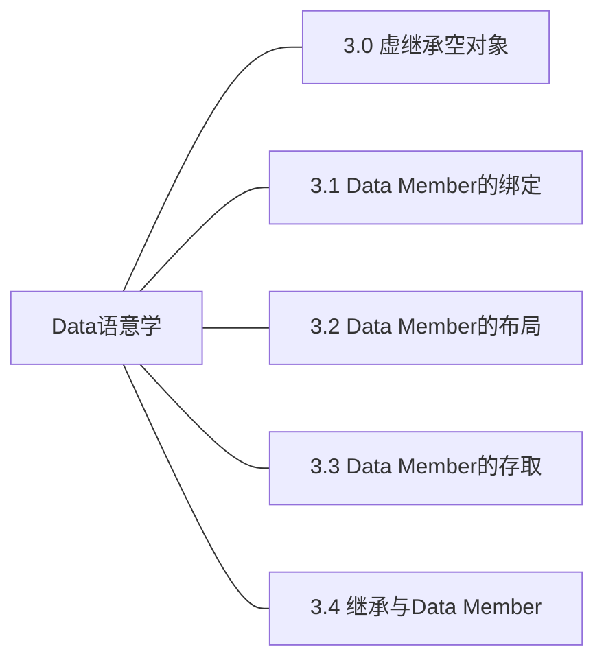

## 第3章 Data语意学


下文实验使用的g++版本如下：
```
Using built-in specs.
COLLECT_GCC=g++
COLLECT_LTO_WRAPPER=/usr/lib/gcc/x86_64-linux-gnu/9/lto-wrapper
OFFLOAD_TARGET_NAMES=nvptx-none:hsa
OFFLOAD_TARGET_DEFAULT=1
Target: x86_64-linux-gnu
Configured with: ../src/configure -v --with-pkgversion='Ubuntu 9.4.0-1ubuntu1~20.04.1' --with-bugurl=file:///usr/share/doc/gcc-9/README.Bugs --enable-languages=c,ada,c++,go,brig,d,fortran,objc,obj-c++,gm2 --prefix=/usr --with-gcc-major-version-only --program-suffix=-9 --program-prefix=x86_64-linux-gnu- --enable-shared --enable-linker-build-id --libexecdir=/usr/lib --without-included-gettext --enable-threads=posix --libdir=/usr/lib --enable-nls --enable-clocale=gnu --enable-libstdcxx-debug --enable-libstdcxx-time=yes --with-default-libstdcxx-abi=new --enable-gnu-unique-object --disable-vtable-verify --enable-plugin --enable-default-pie --with-system-zlib --with-target-system-zlib=auto --enable-objc-gc=auto --enable-multiarch --disable-werror --with-arch-32=i686 --with-abi=m64 --with-multilib-list=m32,m64,mx32 --enable-multilib --with-tune=generic --enable-offload-targets=nvptx-none=/build/gcc-9-Av3uEd/gcc-9-9.4.0/debian/tmp-nvptx/usr,hsa --without-cuda-driver --enable-checking=release --build=x86_64-linux-gnu --host=x86_64-linux-gnu --target=x86_64-linux-gnu
Thread model: posix
gcc version 9.4.0 (Ubuntu 9.4.0-1ubuntu1~20.04.1) 

```

### 3.0 虚继承空对象

### 3.1 Data Member的绑定

### 3.2 Data Member的布局

### 3.3 Data Member的存取
被研究的代码片段：
```c++
Point3d origin;
origin.x = 0.0;
```

需要参考的因素

|表头|静态数据成员|非静态数据成员|
|----|----|----|
|继承|继承的静态数据成员|继承的非静态数据成员|
|非继承|非继承的静态数据成员|非继承的非静态数据成员|

#### 1. 如果x为静态数据成员

1.1 非继承的静态数据成员

实验一：非继承的静态数据成员的存取

实验代码：

```c++
#include<string>
#include<iostream>
using namespace std;
class student{
	private:
		string name;
		int number;
		int exam;
		static int count;  //静态数据是在这里声明而不是定义的
		static int total;
	public:
		student(string s_na,int s_nu,int s_ex) ;
		~student(){};
		void show();
		void print();
};
int student::count=0;  //静态数据在这里定义，如果不定义链接就会报错
int student::total=0; 
student::student(string s_na ,int s_nu , int s_ex ){
	name=s_na;
	number=s_nu;
	exam=s_ex;
	++count;
	total=total+exam;
}
void student::show(){
	cout<<"学生人数："<<count<<"  学生总体成绩："<<total<<endl;
}
void student::print(){
	cout<<"学生名称："<<name<<"  学生学号："<<number<<endl;
	cout<<"***************************"<<endl;
}
int main(){
	student s[3]={student ("张三",1001,10),student ("李四",1002,20),student("王五",1003,30) };
	s[2].show();
	s[3].show();
	return 0;
}

```

实验过程：

```c++
(gdb) tb 27
Temporary breakpoint 1 at 0x1394: file testStaticMember.cpp, line 27.
(gdb) r
Starting program: /mnt/hgfs/VMShare/Inside_the_CPP_Object_Model/a.out 

Temporary breakpoint 1, student::show (this=0x7fffffffe300) at testStaticMember.cpp:27
27		cout<<"学生人数："<<count<<"  学生总体成绩："<<total<<endl;
(gdb) p &count
$1 = (int *) 0x555555558154 <student::count>
(gdb) p &name
$2 = (std::string *) 0x7fffffffe300
(gdb) p &sutdent::count
No symbol "sutdent" in current context.
(gdb) p &(student::count)
$3 = (int *) 0x555555558154 <student::count>
(gdb) disassemble /m
Dump of assembler code for function student::show():
26	void student::show(){
   0x0000555555555384 <+0>:	endbr64 
   0x0000555555555388 <+4>:	push   %rbp
   0x0000555555555389 <+5>:	mov    %rsp,%rbp
   0x000055555555538c <+8>:	sub    $0x10,%rsp
   0x0000555555555390 <+12>:	mov    %rdi,-0x8(%rbp)

27		cout<<"学生人数："<<count<<"  学生总体成绩："<<total<<endl;
=> 0x0000555555555394 <+16>:	lea    0xc6a(%rip),%rsi        # 0x555555556005
   0x000055555555539b <+23>:	lea    0x2c9e(%rip),%rdi        # 0x555555558040 <_ZSt4cout@@GLIBCXX_3.4>
   0x00005555555553a2 <+30>:	callq  0x555555555160 <_ZStlsISt11char_traitsIcEERSt13basic_ostreamIcT_ES5_PKc@plt>
   0x00005555555553a7 <+35>:	mov    %rax,%rdx
   0x00005555555553aa <+38>:	mov    0x2da4(%rip),%eax        # 0x555555558154 <_ZN7student5countE> //这里就是对student::count进行直接存取的地方
   0x00005555555553b0 <+44>:	mov    %eax,%esi
   0x00005555555553b2 <+46>:	mov    %rdx,%rdi
   0x00005555555553b5 <+49>:	callq  0x5555555551d0 <_ZNSolsEi@plt>
   0x00005555555553ba <+54>:	lea    0xc54(%rip),%rsi        # 0x555555556015
   0x00005555555553c1 <+61>:	mov    %rax,%rdi
   0x00005555555553c4 <+64>:	callq  0x555555555160 <_ZStlsISt11char_traitsIcEERSt13basic_ostreamIcT_ES5_PKc@plt>
   0x00005555555553c9 <+69>:	mov    %rax,%rdx
   0x00005555555553cc <+72>:	mov    0x2d86(%rip),%eax        # 0x555555558158 <_ZN7student5totalE>
   0x00005555555553d2 <+78>:	mov    %eax,%esi
   0x00005555555553d4 <+80>:	mov    %rdx,%rdi
   0x00005555555553d7 <+83>:	callq  0x5555555551d0 <_ZNSolsEi@plt>
   0x00005555555553dc <+88>:	mov    %rax,%rdx
   0x00005555555553df <+91>:	mov    0x2bea(%rip),%rax        # 0x555555557fd0
   0x00005555555553e6 <+98>:	mov    %rax,%rsi
   0x00005555555553e9 <+101>:	mov    %rdx,%rdi
   0x00005555555553ec <+104>:	callq  0x555555555170 <_ZNSolsEPFRSoS_E@plt>

28	}
   0x00005555555553f1 <+109>:	nop
   0x00005555555553f2 <+110>:	leaveq 
   0x00005555555553f3 <+111>:	retq   

End of assembler dump.
(gdb) 

```

结论：非继承的静态数据成员是直接进行存取的。

1.2 继承的静态数据成员

与非继承的静态数据成员一样也是直接存取。

实验二：继承的静态数据成员的获取

实验代码：

```c++
#include <iostream>

using namespace std;

class A{
public:
	A()
	{
		cout << "A()" << endl;
	}
	virtual ~A()
	{
		cout << "~A()" << endl;
	}
public:
	static int s_a;
};

class B:public A{
public:
	B()
	{
		cout << "B()" << endl;
	}
	~B()
	{
		cout << "~B()" << endl;
	}
public:
	static int s_b;
};

int A::s_a = 0;
int B::s_b = 0;

int main()
{
	B b;
	A a;
	cout << a.s_a << endl;
	cout << b.s_a << endl;
	cout << b.s_b << endl;
}

```

gdb调试信息如下：

```c++
(gdb) tb 40
Temporary breakpoint 1 at 0x125d: file testStaticMember2.cpp, line 40.
(gdb) r
Starting program: /mnt/hgfs/VMShare/Inside_the_CPP_Object_Model/a.out 
A()
B()
A()

Temporary breakpoint 1, main () at testStaticMember2.cpp:40
40		cout << a.s_a << endl;
(gdb) set disassemble-next-line on
(gdb) disassemble /m
Dump of assembler code for function main():
37	{
   0x0000555555555229 <+0>:	endbr64 
   0x000055555555522d <+4>:	push   %rbp
   0x000055555555522e <+5>:	mov    %rsp,%rbp
   0x0000555555555231 <+8>:	push   %rbx
   0x0000555555555232 <+9>:	sub    $0x28,%rsp
   0x0000555555555236 <+13>:	mov    %fs:0x28,%rax
   0x000055555555523f <+22>:	mov    %rax,-0x18(%rbp)
   0x0000555555555243 <+26>:	xor    %eax,%eax

38		B b;
   0x0000555555555245 <+28>:	lea    -0x28(%rbp),%rax
   0x0000555555555249 <+32>:	mov    %rax,%rdi
   0x000055555555524c <+35>:	callq  0x555555555470 <B::B()>
   0x00005555555552e4 <+187>:	lea    -0x28(%rbp),%rax
   0x00005555555552e8 <+191>:	mov    %rax,%rdi
   0x00005555555552eb <+194>:	callq  0x5555555554ea <B::~B()>
   0x0000555555555322 <+249>:	lea    -0x28(%rbp),%rax
   0x0000555555555326 <+253>:	mov    %rax,%rdi
   0x0000555555555329 <+256>:	callq  0x5555555554ea <B::~B()>
   0x000055555555532e <+261>:	mov    %rbx,%rax
   0x0000555555555331 <+264>:	mov    %rax,%rdi
   0x0000555555555334 <+267>:	callq  0x555555555130 <_Unwind_Resume@plt>

39		A a;
   0x0000555555555251 <+40>:	lea    -0x20(%rbp),%rax
   0x0000555555555255 <+44>:	mov    %rax,%rdi
   0x0000555555555258 <+47>:	callq  0x5555555553ac <A::A()>
   0x00005555555552d8 <+175>:	lea    -0x20(%rbp),%rax
   0x00005555555552dc <+179>:	mov    %rax,%rdi
   0x00005555555552df <+182>:	callq  0x5555555553f6 <A::~A()>
   0x000055555555530d <+228>:	lea    -0x20(%rbp),%rax
   0x0000555555555311 <+232>:	mov    %rax,%rdi
   0x0000555555555314 <+235>:	callq  0x5555555553f6 <A::~A()>
   0x0000555555555319 <+240>:	jmp    0x555555555322 <main()+249>
   0x000055555555531b <+242>:	endbr64 
   0x000055555555531f <+246>:	mov    %rax,%rbx

40		cout << a.s_a << endl;
=> 0x000055555555525d <+52>:	mov    0x2ef1(%rip),%eax        # 0x555555558154 <_ZN1A3s_aE>//父类对自己的静态成员访问
   0x0000555555555263 <+58>:	mov    %eax,%esi
   0x0000555555555265 <+60>:	lea    0x2dd4(%rip),%rdi        # 0x555555558040 <_ZSt4cout@@GLIBCXX_3.4>
   0x000055555555526c <+67>:	callq  0x555555555120 <_ZNSolsEi@plt>
   0x0000555555555271 <+72>:	mov    %rax,%rdx
   0x0000555555555274 <+75>:	mov    0x2d55(%rip),%rax        # 0x555555557fd0
   0x000055555555527b <+82>:	mov    %rax,%rsi
   0x000055555555527e <+85>:	mov    %rdx,%rdi
   0x0000555555555281 <+88>:	callq  0x5555555550f0 <_ZNSolsEPFRSoS_E@plt>

41		cout << b.s_a << endl;
   0x0000555555555286 <+93>:	mov    0x2ec8(%rip),%eax        # 0x555555558154 <_ZN1A3s_aE>//子类对父类的静态成员访问
   0x000055555555528c <+99>:	mov    %eax,%esi
   0x000055555555528e <+101>:	lea    0x2dab(%rip),%rdi        # 0x555555558040 <_ZSt4cout@@GLIBCXX_3.4>
   0x0000555555555295 <+108>:	callq  0x555555555120 <_ZNSolsEi@plt>
--Type <RET> for more, q to quit, c to continue without paging--
   0x000055555555529a <+113>:	mov    %rax,%rdx
   0x000055555555529d <+116>:	mov    0x2d2c(%rip),%rax        # 0x555555557fd0
   0x00005555555552a4 <+123>:	mov    %rax,%rsi
   0x00005555555552a7 <+126>:	mov    %rdx,%rdi
   0x00005555555552aa <+129>:	callq  0x5555555550f0 <_ZNSolsEPFRSoS_E@plt>

42		cout << b.s_b << endl;
   0x00005555555552af <+134>:	mov    0x2ea3(%rip),%eax        # 0x555555558158 <_ZN1B3s_bE>//子类对自己的静态成员访问
   0x00005555555552b5 <+140>:	mov    %eax,%esi
   0x00005555555552b7 <+142>:	lea    0x2d82(%rip),%rdi        # 0x555555558040 <_ZSt4cout@@GLIBCXX_3.4>
   0x00005555555552be <+149>:	callq  0x555555555120 <_ZNSolsEi@plt>
   0x00005555555552c3 <+154>:	mov    %rax,%rdx
   0x00005555555552c6 <+157>:	mov    0x2d03(%rip),%rax        # 0x555555557fd0
   0x00005555555552cd <+164>:	mov    %rax,%rsi
   0x00005555555552d0 <+167>:	mov    %rdx,%rdi
   0x00005555555552d3 <+170>:	callq  0x5555555550f0 <_ZNSolsEPFRSoS_E@plt>

43	}
   0x00005555555552f0 <+199>:	mov    $0x0,%eax
   0x00005555555552f5 <+204>:	mov    -0x18(%rbp),%rcx
   0x00005555555552f9 <+208>:	xor    %fs:0x28,%rcx
   0x0000555555555302 <+217>:	je     0x55555555533e <main()+277>
   0x0000555555555304 <+219>:	jmp    0x555555555339 <main()+272>
   0x0000555555555306 <+221>:	endbr64 
   0x000055555555530a <+225>:	mov    %rax,%rbx
   0x0000555555555339 <+272>:	callq  0x555555555100 <__stack_chk_fail@plt>
   0x000055555555533e <+277>:	add    $0x28,%rsp
   0x0000555555555342 <+281>:	pop    %rbx
   0x0000555555555343 <+282>:	pop    %rbp
   0x0000555555555344 <+283>:	retq   

End of assembler dump.
(gdb) x/1xw 0x2ef1+$rip //父类对自己的静态成员访问
0x55555555814e <_ZSt4cout@@GLIBCXX_3.4+270>:	0x00000000
(gdb) tb *main+93 //断点到距离main偏移93地址的汇编指令处
Temporary breakpoint 2 at 0x555555555286: file testStaticMember2.cpp, line 41.
(gdb) c
Temporary breakpoint 2, main () at testStaticMember2.cpp:41
41		cout << b.s_a << endl;
=> 0x0000555555555286 <main()+93>:	8b 05 c8 2e 00 00	mov    0x2ec8(%rip),%eax        # 0x555555558154 <_ZN1A3s_aE>
(gdb) x/1xw 0x2ec8 + $rip //子类对父类的静态成员访问
0x55555555814e <_ZSt4cout@@GLIBCXX_3.4+270>:	0x00000000
(gdb) b *main + 134 //断点到距离main偏移134地址的汇编指令处
Breakpoint 3 at 0x5555555552af: file testStaticMember2.cpp, line 42.
(gdb) c
Continuing.
0

Breakpoint 3, main () at testStaticMember2.cpp:42
42		cout << b.s_b << endl;
=> 0x00005555555552af <main()+134>:	8b 05 a3 2e 00 00	mov    0x2ea3(%rip),%eax        # 0x555555558158 <_ZN1B3s_bE>
(gdb) x/1xw 0x2ea3 + $rip //子类对自己的静态成员访问
0x555555558152:	0x00000000


```

问题2：空基类内存占用大小

方法：反汇编+gdb调试

实验：

```c++
(gdb) tb 15
Temporary breakpoint 2 at 0x555555555244: file TestClass.cpp, line 15.
(gdb) c
Continuing.

Temporary breakpoint 2, main () at TestClass.cpp:15
15		B b;
(gdb) disassemble /m
Dump of assembler code for function main():
13	{
   0x0000555555555229 <+0>:	endbr64 
   0x000055555555522d <+4>:	push   %rbp
   0x000055555555522e <+5>:	mov    %rsp,%rbp
   0x0000555555555231 <+8>:	sub    $0x40,%rsp
   0x0000555555555235 <+12>:	mov    %fs:0x28,%rax
   0x000055555555523e <+21>:	mov    %rax,-0x8(%rbp)
   0x0000555555555242 <+25>:	xor    %eax,%eax

14		A a, aa;
15		B b;
=> 0x0000555555555244 <+27>:	lea    -0x30(%rbp),%rax
   0x0000555555555248 <+31>:	mov    %rax,%rdi
   0x000055555555524b <+34>:	callq  0x55555555558a <B::B()>

16		C c;
   0x0000555555555250 <+39>:	lea    -0x28(%rbp),%rax
   0x0000555555555254 <+43>:	mov    %rax,%rdi
   0x0000555555555257 <+46>:	callq  0x5555555555ca <C::C()>

17		D d;
   0x000055555555525c <+51>:	lea    -0x20(%rbp),%rax
   0x0000555555555260 <+55>:	mov    %rax,%rdi
   0x0000555555555263 <+58>:	callq  0x5555555555e8 <D::D()>

18		if(&a == &aa) {
19			cout << "a == b" << endl;
20		}
21	
22		cout << "sizeof A: " << sizeof(a) << endl;
   0x0000555555555268 <+63>:	lea    0xd96(%rip),%rsi        # 0x555555556005
   0x000055555555526f <+70>:	lea    0x2dca(%rip),%rdi        # 0x555555558040 <_ZSt4cout@@GLIBCXX_3.4>
   0x0000555555555276 <+77>:	callq  0x555555555100 <_ZStlsISt11char_traitsIcEERSt13basic_ostreamIcT_ES5_PKc@plt>
   0x000055555555527b <+82>:	mov    $0x1,%esi
   0x0000555555555280 <+87>:	mov    %rax,%rdi
   0x0000555555555283 <+90>:	callq  0x5555555550c0 <_ZNSolsEm@plt>
   0x0000555555555288 <+95>:	mov    %rax,%rdx
   0x000055555555528b <+98>:	mov    0x2d3e(%rip),%rax        # 0x555555557fd0
   0x0000555555555292 <+105>:	mov    %rax,%rsi
   0x0000555555555295 <+108>:	mov    %rdx,%rdi
   0x0000555555555298 <+111>:	callq  0x555555555110 <_ZNSolsEPFRSoS_E@plt>

23		cout << "&a: " << hex << &a << " &aa: " << hex << &aa << endl;
   0x000055555555529d <+116>:	lea    0xd6c(%rip),%rsi        # 0x555555556010
   0x00005555555552a4 <+123>:	lea    0x2d95(%rip),%rdi        # 0x555555558040 <_ZSt4cout@@GLIBCXX_3.4>
   0x00005555555552ab <+130>:	callq  0x555555555100 <_ZStlsISt11char_traitsIcEERSt13basic_ostreamIcT_ES5_PKc@plt>
   0x00005555555552b0 <+135>:	lea    0x285(%rip),%rsi        # 0x55555555553c <std::hex(std::ios_base&)>
   0x00005555555552b7 <+142>:	mov    %rax,%rdi
   0x00005555555552ba <+145>:	callq  0x5555555550d0 <_ZNSolsEPFRSt8ios_baseS0_E@plt>
   0x00005555555552bf <+150>:	mov    %rax,%rdx
   0x00005555555552c2 <+153>:	lea    -0x32(%rbp),%rax
   0x00005555555552c6 <+157>:	mov    %rax,%rsi
   0x00005555555552c9 <+160>:	mov    %rdx,%rdi
   0x00005555555552cc <+163>:	callq  0x5555555550e0 <_ZNSolsEPKv@plt>
--Type <RET> for more, q to quit, c to continue without paging--
   0x00005555555552d1 <+168>:	lea    0xd3d(%rip),%rsi        # 0x555555556015
   0x00005555555552d8 <+175>:	mov    %rax,%rdi
   0x00005555555552db <+178>:	callq  0x555555555100 <_ZStlsISt11char_traitsIcEERSt13basic_ostreamIcT_ES5_PKc@plt>
   0x00005555555552e0 <+183>:	lea    0x255(%rip),%rsi        # 0x55555555553c <std::hex(std::ios_base&)>
   0x00005555555552e7 <+190>:	mov    %rax,%rdi
   0x00005555555552ea <+193>:	callq  0x5555555550d0 <_ZNSolsEPFRSt8ios_baseS0_E@plt>
   0x00005555555552ef <+198>:	mov    %rax,%rdx
   0x00005555555552f2 <+201>:	lea    -0x31(%rbp),%rax
   0x00005555555552f6 <+205>:	mov    %rax,%rsi
   0x00005555555552f9 <+208>:	mov    %rdx,%rdi
   0x00005555555552fc <+211>:	callq  0x5555555550e0 <_ZNSolsEPKv@plt>
   0x0000555555555301 <+216>:	mov    %rax,%rdx
   0x0000555555555304 <+219>:	mov    0x2cc5(%rip),%rax        # 0x555555557fd0
   0x000055555555530b <+226>:	mov    %rax,%rsi
   0x000055555555530e <+229>:	mov    %rdx,%rdi
   0x0000555555555311 <+232>:	callq  0x555555555110 <_ZNSolsEPFRSoS_E@plt>

24		cout << "sizeof B: " << sizeof(b) << endl;
   0x0000555555555316 <+237>:	lea    0xcff(%rip),%rsi        # 0x55555555601c
   0x000055555555531d <+244>:	lea    0x2d1c(%rip),%rdi        # 0x555555558040 <_ZSt4cout@@GLIBCXX_3.4>
   0x0000555555555324 <+251>:	callq  0x555555555100 <_ZStlsISt11char_traitsIcEERSt13basic_ostreamIcT_ES5_PKc@plt>
   0x0000555555555329 <+256>:	mov    $0x8,%esi
   0x000055555555532e <+261>:	mov    %rax,%rdi
   0x0000555555555331 <+264>:	callq  0x5555555550c0 <_ZNSolsEm@plt>
   0x0000555555555336 <+269>:	mov    %rax,%rdx
   0x0000555555555339 <+272>:	mov    0x2c90(%rip),%rax        # 0x555555557fd0
   0x0000555555555340 <+279>:	mov    %rax,%rsi
   0x0000555555555343 <+282>:	mov    %rdx,%rdi
   0x0000555555555346 <+285>:	callq  0x555555555110 <_ZNSolsEPFRSoS_E@plt>

25		cout << "sizeof C: " << sizeof(c) << endl;
   0x000055555555534b <+290>:	lea    0xcd5(%rip),%rsi        # 0x555555556027
   0x0000555555555352 <+297>:	lea    0x2ce7(%rip),%rdi        # 0x555555558040 <_ZSt4cout@@GLIBCXX_3.4>
   0x0000555555555359 <+304>:	callq  0x555555555100 <_ZStlsISt11char_traitsIcEERSt13basic_ostreamIcT_ES5_PKc@plt>
   0x000055555555535e <+309>:	mov    $0x8,%esi
   0x0000555555555363 <+314>:	mov    %rax,%rdi
   0x0000555555555366 <+317>:	callq  0x5555555550c0 <_ZNSolsEm@plt>
   0x000055555555536b <+322>:	mov    %rax,%rdx
   0x000055555555536e <+325>:	mov    0x2c5b(%rip),%rax        # 0x555555557fd0
   0x0000555555555375 <+332>:	mov    %rax,%rsi
   0x0000555555555378 <+335>:	mov    %rdx,%rdi
   0x000055555555537b <+338>:	callq  0x555555555110 <_ZNSolsEPFRSoS_E@plt>

26		cout << "sizeof D: " << sizeof(d) << endl;
   0x0000555555555380 <+343>:	lea    0xcab(%rip),%rsi        # 0x555555556032
   0x0000555555555387 <+350>:	lea    0x2cb2(%rip),%rdi        # 0x555555558040 <_ZSt4cout@@GLIBCXX_3.4>
   0x000055555555538e <+357>:	callq  0x555555555100 <_ZStlsISt11char_traitsIcEERSt13basic_ostreamIcT_ES5_PKc@plt>
   0x0000555555555393 <+362>:	mov    $0x10,%esi
   0x0000555555555398 <+367>:	mov    %rax,%rdi
   0x000055555555539b <+370>:	callq  0x5555555550c0 <_ZNSolsEm@plt>
   0x00005555555553a0 <+375>:	mov    %rax,%rdx
   0x00005555555553a3 <+378>:	mov    0x2c26(%rip),%rax        # 0x555555557fd0
   0x00005555555553aa <+385>:	mov    %rax,%rsi
   0x00005555555553ad <+388>:	mov    %rdx,%rdi
   0x00005555555553b0 <+391>:	callq  0x555555555110 <_ZNSolsEPFRSoS_E@plt>
--Type <RET> for more, q to quit, c to continue without paging--

27		return 0;
   0x00005555555553b5 <+396>:	mov    $0x0,%eax

28	}
   0x00005555555553ba <+401>:	mov    -0x8(%rbp),%rcx
   0x00005555555553be <+405>:	xor    %fs:0x28,%rcx
   0x00005555555553c7 <+414>:	je     0x5555555553ce <main()+421>
   0x00005555555553c9 <+416>:	callq  0x555555555120 <__stack_chk_fail@plt>
   0x00005555555553ce <+421>:	leaveq 
   0x00005555555553cf <+422>:	retq   

End of assembler dump.
(gdb)  tb 23
Temporary breakpoint 3 at 0x55555555529d: file TestClass.cpp, line 23.
(gdb) c
Continuing.
sizeof A: 1

Temporary breakpoint 3, main () at TestClass.cpp:23
23		cout << "&a: " << hex << &a << " &aa: " << hex << &aa << endl;
(gdb) i r
rax            0x555555558040      93824992247872
rbx            0x555555555650      93824992237136
rcx            0x7ffff7cf00a7      140737350926503
rdx            0x0                 0
rsi            0x0                 0
rdi            0x7ffff7dd07e0      140737351845856
rbp            0x7fffffffe350      0x7fffffffe350
rsp            0x7fffffffe310      0x7fffffffe310
r8             0x0                 0
r9             0x7fffffffe200      140737488347648
r10            0xfffffffffffff04a  -4022
r11            0x7ffff7c64370      140737350353776
r12            0x555555555140      93824992235840
r13            0x7fffffffe440      140737488348224
r14            0x0                 0
r15            0x0                 0
rip            0x55555555529d      0x55555555529d <main()+116>
eflags         0x213               [ CF AF IF ]
cs             0x33                51
ss             0x2b                43
ds             0x0                 0
es             0x0                 0
fs             0x0                 0
gs             0x0                 0
(gdb) p/x $rbp
$1 = 0x7fffffffe350
(gdb) p/x $rbp - 0x32
$2 = 0x7fffffffe31e
(gdb) p/x $rbp - 0x31
$3 = 0x7fffffffe31f
(gdb) p/x &a
$4 = 0x7fffffffe31e
(gdb) p/x &aa
$5 = 0x7fffffffe31f
(gdb) 
```


#### 2. 如果x为非静态数据成员

实验一：非继承和继承的成员数据的存取过程

```c++
#include <iostream>

using namespace std;

class A {
	public:
		A(int a1, int a2):m_a1(a1), m_a2(a2){}
		virtual void print()
		{
			cout << "A.a1: " << m_a1 << endl;
		}
		virtual void printa2()
		{
			cout << "A.a2: " << m_a2 << endl;
		}
		virtual ~A()
		{
			cout << "~A()" << endl;
		}
	private:
		int m_a1;
	public:
		int m_a2;

};

class B:public A {
	public:
	void printa2()
	{
		cout << "B.m_a2: " << m_a2 << endl;//获取父类的成员编程
	}
	void printb()
	{
		cout << "B.b: " << m_b1 << endl; //获取自己的成员编程
	}
	B(int b1):A(1,2), m_b1(b1){}

	~B(){
		cout << "~B()" << endl;
	}
	private:
	int m_b1;  
};

int main()
{
	B b(66);
	cout << "Get m_a2" << endl;
	b.printa2();
	cout << "Get m_b1" << endl;
	b.printb();
	b.print(); //使用父类方法获取变量
	return 0;
}

```
实验过程：

```c++
(gdb) tb 31  //断点到printa2处
Temporary breakpoint 1 at 0x14e0: file testNoStaticMember1.cpp, line 31.
(gdb) r
Temporary breakpoint 1, B::printa2 (this=0x7fffffffe320) at testNoStaticMember1.cpp:31
31			cout << "B.m_a2: " << m_a2 << endl;
(gdb) disassemble
Dump of assembler code for function B::printa2():
   0x00005555555554d0 <+0>:	endbr64 
   0x00005555555554d4 <+4>:	push   %rbp
   0x00005555555554d5 <+5>:	mov    %rsp,%rbp
   0x00005555555554d8 <+8>:	sub    $0x10,%rsp
   0x00005555555554dc <+12>:	mov    %rdi,-0x8(%rbp)
=> 0x00005555555554e0 <+16>:	lea    0xb31(%rip),%rsi        # 0x555555556018
   0x00005555555554e7 <+23>:	lea    0x2b52(%rip),%rdi        # 0x555555558040 <_ZSt4cout@@GLIBCXX_3.4>
   0x00005555555554ee <+30>:	callq  0x5555555550d0 <_ZStlsISt11char_traitsIcEERSt13basic_ostreamIcT_ES5_PKc@plt>
   0x00005555555554f3 <+35>:	mov    %rax,%rdx
   0x00005555555554f6 <+38>:	mov    -0x8(%rbp),%rax
   0x00005555555554fa <+42>:	mov    0xc(%rax),%eax   //这里就是对m_a2进行取的过程
   0x00005555555554fd <+45>:	mov    %eax,%esi
   0x00005555555554ff <+47>:	mov    %rdx,%rdi
   0x0000555555555502 <+50>:	callq  0x555555555120 <_ZNSolsEi@plt>
   0x0000555555555507 <+55>:	mov    %rax,%rdx
   0x000055555555550a <+58>:	mov    0x2abf(%rip),%rax        # 0x555555557fd0
   0x0000555555555511 <+65>:	mov    %rax,%rsi
   0x0000555555555514 <+68>:	mov    %rdx,%rdi
   0x0000555555555517 <+71>:	callq  0x5555555550f0 <_ZNSolsEPFRSoS_E@plt>
   0x000055555555551c <+76>:	nop
   0x000055555555551d <+77>:	leaveq 
   0x000055555555551e <+78>:	retq
(gdb) ni //在gdb上设置set disassemble-next-line on后可以使用ni进行汇编语言级别调试
0x00005555555554fa	31			cout << "B.m_a2: " << m_a2 << endl;
   0x00005555555554f6 <B::printa2()+38>:	48 8b 45 f8	mov    -0x8(%rbp),%rax
=> 0x00005555555554fa <B::printa2()+42>:	8b 40 0c	mov    0xc(%rax),%eax
   0x00005555555554fd <B::printa2()+45>:	89 c6	mov    %eax,%esi
   0x00005555555554ff <B::printa2()+47>:	48 89 d7	mov    %rdx,%rdi
   0x0000555555555502 <B::printa2()+50>:	e8 19 fc ff ff	callq  0x555555555120 <_ZNSolsEi@plt>
   0x0000555555555507 <B::printa2()+55>:	48 89 c2	mov    %rax,%rdx
(gdb) p/x $rax//查看rax寄存器
$4 = 0x7fffffffe320
(gdb) x/1xw 0x7fffffffe320+0xc //获取m_a2的值
0x7fffffffe32c:	0x00000002
(gdb) tb 35 //断点到printb处
Temporary breakpoint 2 at 0x555555555530: file testNoStaticMember1.cpp, line 35.
(gdb) c
Temporary breakpoint 2, B::printb (this=0x7fffffffe320) at testNoStaticMember1.cpp:35
35			cout << "B.b: " << m_b1 << endl;
(gdb) ni
0x000055555555554a	35			cout << "B.b: " << m_b1 << endl;
   0x0000555555555546 <B::printb()+38>:	48 8b 45 f8	mov    -0x8(%rbp),%rax
=> 0x000055555555554a <B::printb()+42>:	8b 40 10	mov    0x10(%rax),%eax
   0x000055555555554d <B::printb()+45>:	89 c6	mov    %eax,%esi
   0x000055555555554f <B::printb()+47>:	48 89 d7	mov    %rdx,%rdi
   0x0000555555555552 <B::printb()+50>:	e8 c9 fb ff ff	callq  0x555555555120 <_ZNSolsEi@plt>
   0x0000555555555557 <B::printb()+55>:	48 89 c2	mov    %rax,%rdx
(gdb) x/1xw 0x10+$rax //获取m_b1的值
0x7fffffffe330:	0x00000042
```

实验结论：
**非继承和继承的成员数据的存取过程一样，成员数据在编译时期就已经确定位置了，可直接存取。**

### 3.4 继承与Data Member

入门实验：无继承下的Data Member布局

实验代码：

```c++
//fileName : Point2D.cpp
#include <iostream>

using namespace std;

class Point2D{
	public:
		Point2D(int x, int y):_x(x), _y(y) {}
		~Point2D() {
			cout << "~Point2D" << endl;
		}

		void print() {
			cout << "( " << _x << " , " << _y << " )" << endl;
		}
	private:
		int _x, _y;
};

class Point3D{
	public:
		Point3D(int x, int y, int z):_x(x), _y(y), _z(z) {}
		~Point3D() {
			cout << "~Point3D" << endl;
		}

		void print() {
			cout << "( " << _x << " , " << _y << " , " << _z <<  " )" << endl;
		}
	private:
		int _x, _y, _z;
};

int main()
{
	Point2D pt2(1,2);
	pt2.print();
	Point3D pt3(3,4,5);
	pt3.print();

	return 0;
}

```

调试过程：

```c++
Temporary breakpoint 1, main () at Point2D.cpp:36
36		pt2.print();
(gdb) tb 14
Temporary breakpoint 2 at 0x5555555553b8: file Point2D.cpp, line 14.
(gdb) c
Continuing.

Temporary breakpoint 2, Point2D::print (this=0x7fffffffe304) at Point2D.cpp:14
14				cout << "( " << _x << " , " << _y << " )" << endl;
(gdb) disassemble
Dump of assembler code for function Point2D::print():
   0x00005555555553a8 <+0>:	endbr64 
   0x00005555555553ac <+4>:	push   %rbp
   0x00005555555553ad <+5>:	mov    %rsp,%rbp
   0x00005555555553b0 <+8>:	sub    $0x10,%rsp
   0x00005555555553b4 <+12>:	mov    %rdi,-0x8(%rbp)
=> 0x00005555555553b8 <+16>:	lea    0xc4f(%rip),%rsi        # 0x55555555600e
   0x00005555555553bf <+23>:	lea    0x2c7a(%rip),%rdi        # 0x555555558040 <_ZSt4cout@@GLIBCXX_3.4>
   0x00005555555553c6 <+30>:	callq  0x5555555550c0 <_ZStlsISt11char_traitsIcEERSt13basic_ostreamIcT_ES5_PKc@plt>
   0x00005555555553cb <+35>:	mov    %rax,%rdx
   0x00005555555553ce <+38>:	mov    -0x8(%rbp),%rax
   0x00005555555553d2 <+42>:	mov    (%rax),%eax   //对成员变量_x的读取
   0x00005555555553d4 <+44>:	mov    %eax,%esi
   0x00005555555553d6 <+46>:	mov    %rdx,%rdi
   0x00005555555553d9 <+49>:	callq  0x555555555100 <_ZNSolsEi@plt>
   0x00005555555553de <+54>:	lea    0xc2c(%rip),%rsi        # 0x555555556011
   0x00005555555553e5 <+61>:	mov    %rax,%rdi
   0x00005555555553e8 <+64>:	callq  0x5555555550c0 <_ZStlsISt11char_traitsIcEERSt13basic_ostreamIcT_ES5_PKc@plt>
   0x00005555555553ed <+69>:	mov    %rax,%rdx
   0x00005555555553f0 <+72>:	mov    -0x8(%rbp),%rax
   0x00005555555553f4 <+76>:	mov    0x4(%rax),%eax   //对成员变量_y的读取
   0x00005555555553f7 <+79>:	mov    %eax,%esi
   0x00005555555553f9 <+81>:	mov    %rdx,%rdi
   0x00005555555553fc <+84>:	callq  0x555555555100 <_ZNSolsEi@plt>
   0x0000555555555401 <+89>:	lea    0xc0d(%rip),%rsi        # 0x555555556015
   0x0000555555555408 <+96>:	mov    %rax,%rdi
   0x000055555555540b <+99>:	callq  0x5555555550c0 <_ZStlsISt11char_traitsIcEERSt13basic_ostreamIcT_ES5_PKc@plt>
   0x0000555555555410 <+104>:	mov    %rax,%rdx
   0x0000555555555413 <+107>:	mov    0x2bb6(%rip),%rax        # 0x555555557fd0
   0x000055555555541a <+114>:	mov    %rax,%rsi
   0x000055555555541d <+117>:	mov    %rdx,%rdi
   0x0000555555555420 <+120>:	callq  0x5555555550d0 <_ZNSolsEPFRSoS_E@plt>
   0x0000555555555425 <+125>:	nop
   0x0000555555555426 <+126>:	leaveq 
   0x0000555555555427 <+127>:	retq   
End of assembler dump.
(gdb) set disassemble-next-line on
(gdb) ni 5
(gdb) x/1xw $rax
0x7fffffffe304:	0x00000001  //_x的值
(gdb) ni 9
(gdb) x/1xw $rax + 0x4
0x7fffffffe308:	0x00000002  //_y的值
...
(gdb) ni 5
0x00005555555554c4	27				cout << "( " << _x << " , " << _y << " , " << _z <<  " )" << endl;
   0x00005555555554c0 <Point3D::print()+38>:	48 8b 45 f8	mov    -0x8(%rbp),%rax
=> 0x00005555555554c4 <Point3D::print()+42>:	8b 00	mov    (%rax),%eax //读取_x, _y, _z三个变量
   0x00005555555554c6 <Point3D::print()+44>:	89 c6	mov    %eax,%esi
   0x00005555555554c8 <Point3D::print()+46>:	48 89 d7	mov    %rdx,%rdi
   0x00005555555554cb <Point3D::print()+49>:	e8 30 fc ff ff	callq  0x555555555100 <_ZNSolsEi@plt>
   0x00005555555554d0 <Point3D::print()+54>:	48 8d 35 3a 0b 00 00	lea    0xb3a(%rip),%rsi        # 0x555555556011
   0x00005555555554d7 <Point3D::print()+61>:	48 89 c7	mov    %rax,%rdi
   0x00005555555554da <Point3D::print()+64>:	e8 e1 fb ff ff	callq  0x5555555550c0 <_ZStlsISt11char_traitsIcEERSt13basic_ostreamIcT_ES5_PKc@plt>
   0x00005555555554df <Point3D::print()+69>:	48 89 c2	mov    %rax,%rdx
(gdb) x/3xw $rax  //一次打印处_x, _y, _z三个变量的值
0x7fffffffe30c:	0x00000003	0x00000004	0x00000005


```

实验结论:

对于Point2D的两个成员变量的内存布局如下表所示：
|变量地址|变量名|
|--|--|
|0x7fffffffe304|_x|
|0x7fffffffe308|_y|

结合变量_x和_y的定义位置可以得出一个推论：先定义的变量在低地址。

同理可以推断出Point3D的三个成员变量的内存布局如下表所示：
|变量地址|变量名|
|--|--|
|0x7fffffffe30c|_x|
|0x7fffffffe310|_y|
|0x7fffffffe314|_z|

考虑四种情况：

1. 单一继承且不含virtual functions;
2. 单一继承并含virtual functions;
3. 多重继承；
4. 虚拟继承；

#### 只要继承不要多态
考虑上述的第一种情况

实验二：具体继承下的数据成员分布

```c++
#include <iostream>

using namespace std;

class Point2D{
	public:
		Point2D(float x = 0.0, float y = 0.0): _x(x), _y(y){}

		float x() {return _x;}

		float y() {return _y;}

		void x(float newX) {_x = newX;}

		void y(float newY) {_y = newY;}

		void operator += (Point2D &rhs) {
			_x += rhs.x();
			_y += rhs.y();
		}

	protected:
		float _x, _y;

};

class Point3D: public Point2D{
	public:
		Point3D(float x = 0.0, float y = 0.0, float z = 0.0): Point2D(x, y), _z(z){}

		float z() {return _z;}

		void z(float newZ) {_z = newZ;}

		void operator += (Point3D &rhs) {
			Point2D::operator+=(rhs);
			_z += rhs.z();
		}

	protected:
		float _z;
};

int main()
{
	Point2D pt2(1.0, 2.9);

	Point3D pt3(3.2, 4.3, 5.4);

	cout << "( " << pt2.x() << " , " << pt2.y() << " )" << endl;

	cout << "( " << pt3.x() << " , " << pt3.y() << " , " << pt3.z() << " )" << endl;

	return 0;
}

```

调试过程

```c++
(gdb) tb 31
Temporary breakpoint 1 at 0x1488: file Chart3_2.cpp, line 31.
(gdb) r
Starting program: /mnt/hgfs/VMShare/Inside_the_CPP_Object_Model/DataAlgh/a.out 
( 1 , 2.9 )

Temporary breakpoint 1, Point3D::z (this=0x7fffffffe330) at Chart3_2.cpp:31
31			float z() {return _z;}
(gdb) set disassemble-next-line on
(gdb) disassemble
Dump of assembler code for function Point3D::z():
=> 0x0000555555555488 <+0>:	endbr64 
   0x000055555555548c <+4>:	push   %rbp
   0x000055555555548d <+5>:	mov    %rsp,%rbp
   0x0000555555555490 <+8>:	mov    %rdi,-0x8(%rbp)
   0x0000555555555494 <+12>:	mov    -0x8(%rbp),%rax
   0x0000555555555498 <+16>:	movss  0x8(%rax),%xmm0  //xmm0保存的就是_z
   0x000055555555549d <+21>:	pop    %rbp
   0x000055555555549e <+22>:	retq   
End of assembler dump.
(gdb) ni 5
0x0000555555555498	31			float z() {return _z;}
   0x0000555555555494 <Point3D::z()+12>:	48 8b 45 f8	mov    -0x8(%rbp),%rax
=> 0x0000555555555498 <Point3D::z()+16>:	f3 0f 10 40 08	movss  0x8(%rax),%xmm0
(gdb) x/3xw $rax
0x7fffffffe30c:	0x404ccccd	0x4089999a	0x40accccd
(gdb) 
```

结论：
|Point2D变量地址|变量名|
|--|--|
|0x7fffffffe304|_x|
|0x7fffffffe308|_y|

|Point3D变量地址|变量名|变量所属对象的类|
|--|--|--|
|0x7fffffffe30c|_x|Point2D|
|0x7fffffffe310|_y|Point2D|
|0x7fffffffe314|_z|Point3D|

具体继承的使用场景和注意事项

设计的好处：

1. 将把对_x和_y坐标的管理局部化了，同时表现出了Point2D和Point3D之间的密切关系。

设计的坏处：
1. 经验不足的人可能会重复设计一些相同的操作函数；
2. 把一个class分解成两层或更多层，有可能会为了抽象化而导致空间膨胀。

坏处的第二点可以用下面的示例说明问题：

实验：说明类继承导致空间膨胀的示例

测试代码：

```c++
#include <iostream>

using namespace std;


class Concrete {
	public:
		Concrete():val(1), c1(2), c2(3),c3(4)
		{
			cout << "Concrete()" << endl;
		}
		~Concrete()
		{
			cout << "~Concrete()" << endl;
		}

	private:
		int val;
		char c1;
		char c2;
		char c3;
};

class Concrete1 {
	public:
		Concrete1():val(5),c1(6)
		{
			cout << "Concrete1()" << endl;
		}
		~Concrete1()
		{
			cout << "~Concrete1()" << endl;
		}

	private:
		int val;
		char c1;
};


class Concrete2: public Concrete1 {
	public:
		Concrete2():bit2(7)
		{
			cout << "Concrete2()" << endl;
		}
		~Concrete2()
		{
			cout << "~Concrete2()" << endl;
		}

	private:
		char bit2;
};

class Concrete3: public Concrete2 {
	public:
		Concrete3():bit3(8)
		{
			cout << "Concrete3()" << endl;
		}
		~Concrete3()
		{
			cout << "~Concrete3()" << endl;
		}

	private:
		char bit3;
};

int main()
{
	Concrete3 c3;
	Concrete1* c1 = &c3;
	Concrete c0;
	cout << sizeof(c3) <<  " &c3: " << hex << &c3 << endl;
	cout << sizeof(c0) << " &c0:" << hex << &c0 << endl;
	cout << sizeof(*c1) << " c1: " << hex << c1 << endl;
	return 0;
}

```

测试过程：

```c++
Concrete1()
Concrete2()
Concrete3()
Concrete()
8 &c3: 0x7ffce1fe7178
8 &c0:0x7ffce1fe7180
8 c1: 0x7ffce1fe7178
~Concrete()
~Concrete3()
~Concrete2()
~Concrete1()

//更具体的调试看一下内存的值
Temporary breakpoint 1, main () at Chart3_3.cpp:78
78		cout << sizeof(*c1) << " c1: " << hex << c1 << endl;
(gdb) p c3
$1 = {<Concrete2> = {<Concrete1> = {val = 5, c1 = 6 '\006'}, bit2 = 7 '\a'}, bit3 = 8 '\b'}
(gdb) p/x &c3
$2 = 0x7fffffffe308
(gdb) p sizeof(c3)
$3 = 8
(gdb) x/2xw &c3
0x7fffffffe308:	0x00000005	0x00080706  //这里的并没有出现侯捷在文中提到的类的字节对齐导致的空间浪费
(gdb) 

```

结论：

依据侯捷在文中的描述，c3的空间结构应该如下表：
|地址|变量|所属类|
|--|--|--|
|0x7ffce1fe7178|val|Concrete1|
|0x7ffce1fe717c|c1|Concrete1|
|0x7ffce1fe717d|padding|Concrete1|
|0x7ffce1fe717e|padding|Concrete1|
|0x7ffce1fe717f|padding|Concrete1|
|0x7ffce1fe7180|bit2|Concrete2|
|0x7ffce1fe7181|padding|Concrete2|
|0x7ffce1fe7182|padding|Concrete2|
|0x7ffce1fe7183|padding|Concrete2|
|0x7ffce1fe7184|bit3|Concrete3|
|0x7ffce1fe7185|padding|Concrete3|
|0x7ffce1fe7186|padding|Concrete3|
|0x7ffce1fe7187|padding|Concrete3|

共占据16个字节

但是从实验来看并不是这样，而是：

|地址|变量|所属类|
|--|--|--|
|0x7ffce1fe7178|val|Concrete1|
|0x7ffce1fe717c|c1|Concrete1|
|0x7ffce1fe717d|bit2|Concrete2|
|0x7ffce1fe717e|bit3|Concrete3|
|0x7ffce1fe717f|padding|Concrete3|

共占据8个字节

<font face="楷体" color='red'>这就表明其空间并没有发生膨胀，且通过c1可以获取到c3中的bit2和bit3变量。</font>

#### 加上多态

多态要解决的问题：

```c++
void  foo(Point2d &p1, Point2d &p2) {
   //...
   p1 += p2;
   //...
}
```

在foo函数中p1和p2既可以时Point2d也可以时Point3d对象，实现一个函数同时操作多种数据类型。

多态在时间可空间上带来的代价：

1. 类多出一个虚表；
2. 每一个类对象多出一个虚表指针；
3. 加强构造函数，使他能够为虚表指针赋值；
4. 加强析构函数，销毁虚表指针；

从哪些维度考虑平衡多态的利弊：

1. 类对象的个数和生命周期；
2. 多态程序设计所带来的利益；

实验：虚函数调用过程探究

实验代码：

```c++
#include <iostream>

using namespace std;

class Point2d{
	public:
		Point2d(float x = 0.0, float y = 0.0):_x(x), _y(y)
		{
			cout << "Point2d()" << endl;
		}

		virtual ~Point2d()
		{
			cout << "~Point2d" << endl;
		}
		virtual float x()
		{
			return _x;
		}

		virtual float y()
		{
			return _y;
		}

		virtual float z()
		{
			return 0.0;
		}

		virtual void z(float z)
		{
			cout << "z(float)" << endl;
		}

		virtual void operator+=(Point2d& rhs)
		{
			_x += rhs.x();
			_y += rhs.y();
		}

	protected:
		float _x, _y;
};


class Point3d:public Point2d {
	public:
		Point3d(float x = 0.0, float y = 0.0, float z = 0.0)
			:Point2d(x, y), _z(z)
		{
			cout << "Point3d()" << endl;
		}

		virtual ~Point3d()
		{
			cout << "~Point3d()" << endl;
		}

		float z()
		{
			return _z;
		}

		void z(float newZ)
		{
			_z = newZ;
		}

		void operator+=(Point2d& rhs){
			Point2d::operator+=(rhs);
			_z += rhs.z();
		}

	protected:
		float _z;
};

void getZ(Point2d* const pt)
{
	cout << "getZ: " << pt->z() << endl;
}

int main()
{
	Point2d p2d(2.1, 2.2);
	Point3d p3d(3.1, 3.2, 3.3);

	p3d += p2d;
	
	getZ(&p2d);  //TODO: 查看getZ对p2d和p3d调用z()函数的实现

	getZ(&p3d);
	
	return 0;
}
```
实验过程：

```c++
(gdb) ni 3
0x000055555555524d	81		cout << "getZ: " << pt->z() << endl;
   0x000055555555523a <getZ(Point2d*)+17>:	48 8d 35 f5 0d 00 00	lea    0xdf5(%rip),%rsi        # 0x555555556036
   0x0000555555555241 <getZ(Point2d*)+24>:	48 8d 3d f8 2d 00 00	lea    0x2df8(%rip),%rdi        # 0x555555558040 <_ZSt4cout@@GLIBCXX_3.4>
   0x0000555555555248 <getZ(Point2d*)+31>:	e8 93 fe ff ff	callq  0x5555555550e0 <_ZStlsISt11char_traitsIcEERSt13basic_ostreamIcT_ES5_PKc@plt>
=> 0x000055555555524d <getZ(Point2d*)+36>:	48 89 c3	mov    %rax,%rbx
(gdb) disassemble
Dump of assembler code for function getZ(Point2d*):
   0x0000555555555229 <+0>:	endbr64 
   0x000055555555522d <+4>:	push   %rbp
   0x000055555555522e <+5>:	mov    %rsp,%rbp
   0x0000555555555231 <+8>:	push   %rbx
   0x0000555555555232 <+9>:	sub    $0x18,%rsp
   0x0000555555555236 <+13>:	mov    %rdi,-0x18(%rbp)
   0x000055555555523a <+17>:	lea    0xdf5(%rip),%rsi        # 0x555555556036
   0x0000555555555241 <+24>:	lea    0x2df8(%rip),%rdi        # 0x555555558040 <_ZSt4cout@@GLIBCXX_3.4>
   0x0000555555555248 <+31>:	callq  0x5555555550e0 <_ZStlsISt11char_traitsIcEERSt13basic_ostreamIcT_ES5_PKc@plt>
=> 0x000055555555524d <+36>:	mov    %rax,%rbx
   0x0000555555555250 <+39>:	mov    -0x18(%rbp),%rax //FIXME: 1. 获取到this指针
   0x0000555555555254 <+43>:	mov    (%rax),%rax //FIXME: 2. 获取到this指针指向的虚表地址
   0x0000555555555257 <+46>:	add    $0x20,%rax //FIXME: 3. 虚表地址偏移0x20获取到z()函数的地址指针
   0x000055555555525b <+50>:	mov    (%rax),%rdx //FIXME: 4. 获取到z()函数的地址
   0x000055555555525e <+53>:	mov    -0x18(%rbp),%rax
   0x0000555555555262 <+57>:	mov    %rax,%rdi
   0x0000555555555265 <+60>:	callq  *%rdx  //FIXME: 5. 执行z()函数
   0x0000555555555267 <+62>:	mov    %rbx,%rdi
   0x000055555555526a <+65>:	callq  0x5555555550c0 <_ZNSolsEf@plt>
```

结论：
虚函数的执行过程由以下四步：
1. 获取到this指针；
2. 获取到this指针指向的虚表地址；
3. 虚表地址偏移指定的地址获取到要执行的虚函数的地址指针；
4. 获取到要执行的虚函数的地址；
5. 执行虚函数；

实函数调用与虚函数调用的区别：

1. 从时间成本上的区别：虚函数调用到函数本身需要5次取地址，而实函数只需要一步。
2. 从空间上看：虚函数调用需要经过虚表，相比实函数，虚函数的空间浪费了一个虚表。

<font face="楷体" color='red'>一个扩展问题：虚表被存放在了哪个区？堆？栈？数据区？代码区?其他？</font>

#### 多重继承——虚表探究

问题1. 虚表被存放在哪个区？
问题2. 多重继承下的虚表包含哪些内容？

实验：
实验代码
```c++
#include <iostream>

using namespace std;

class Point2d {
    public:
        Point2d():_x(0), _y(0)
        {
            cout << "Point2d()" << endl;
        }
        virtual ~Point2d(){
            cout << "~Point2d()" << endl;
        }
    private:
        float _x, _y;
};

class Point3d: public Point2d {
    public:
        Point3d():Point2d(), _z(0){
            cout << "Point3d()" << endl;
        }
        virtual ~Point3d(){
            cout << "~Point3d()" << endl;
        }
    private:
        float _z;
};

class Vertex {
    public:
        Vertex():next(NULL){
            cout << "Vertex()" << endl;
        }
        virtual ~Vertex(){
            cout << "~Vertex()" << endl;
        }
    protected:
        Vertex *next;
};

class Vertex3d:public Point3d,public Vertex {
    public:
        Vertex3d():Point3d(), Vertex(), mumble(0){
            cout << "Vertex3d" << endl;
        }
        virtual ~Vertex3d(){
            cout << "~Vertex3d()" << endl;
        }

    private:
        float mumble;
};

void Mumble(const Vertex* v)
{

}

int main()
{
    Vertex3d v3d;
    Vertex3d v3d1;
    Vertex* pv;
    Point2d*  p2d;
    Point3d* p3d;
    Point3d* p3d1;
    pv = &v3d;
    p3d = &v3d;
    p3d1 = &v3d1;
    p2d = &v3d;
    cout << hex << pv << endl;
    cout << hex << p3d << endl;
    cout << hex << p3d1 << endl;
    cout << hex << p2d << endl;

    return 0;
}
```
调试过程如下：
```c++
Temporary breakpoint 1, main () at char3_5.cpp:72
72          cout << hex << pv << endl;
(gdb) p/x &v3d
$1 = 0x7ffffffee110
(gdb) p/x &v3d1
$2 = 0x7ffffffee140
(gdb) x/10xg $1
0x7ffffffee110: 0x0000000008201c58      0x0000000000000000 #(0x0000000008201c58 就是虚表指针)
0x7ffffffee120: 0x0000000000000000      0x0000000008201c78
0x7ffffffee130: 0x0000000000000000      0x0000000100000000
0x7ffffffee140: 0x0000000008201c58      0x0000000000000000
0x7ffffffee150: 0x0000000000000000      0x0000000008201c78
(gdb) x/10xg $2
0x7ffffffee140: 0x0000000008201c58      0x0000000000000000
0x7ffffffee150: 0x0000000000000000      0x0000000008201c78
0x7ffffffee160: 0x0000000000000000      0x0000000000000000
0x7ffffffee170: 0x0000000008001590      0xf11b39bbe2d3af00
0x7ffffffee180: 0x00007ffffffee270      0x0000000000000000
(gdb) shell ps -ef|grep a.out
xuhuanh+  6116  5527  0 17:55 tty1     00:00:00 gdb a.out
xuhuanh+  6118  6116  0 17:55 tty1     00:00:00 /mnt/f/VMShare/Inside_the_CPP_Object_Model/DataAlgh/a.out
xuhuanh+  6131  5918  0 17:57 tty2     00:00:00 grep --color=auto a.out
(gdb) shell cat /proc/6118/maps
08000000-08001000 rwxp 00000000 00:00 26559                      /mnt/f/VMShare/Inside_the_CPP_Object_Model/DataAlgh/a.out
08001000-08002000 r-xp 00001000 00:00 26559                      /mnt/f/VMShare/Inside_the_CPP_Object_Model/DataAlgh/a.out (.text)
08201000-08202000 r--p 00001000 00:00 26559                      /mnt/f/VMShare/Inside_the_CPP_Object_Model/DataAlgh/a.out(.data)
08202000-08203000 rw-p 00002000 00:00 26559                      /mnt/f/VMShare/Inside_the_CPP_Object_Model/DataAlgh/a.out(.bss)
08403000-08424000 rw-p 00000000 00:00 0                          [heap]
7ffffe6b0000-7ffffe84d000 r-xp 00000000 00:00 562181             /lib/x86_64-linux-gnu/libm-2.27.so
...
7fffff62a000-7fffff62b000 rw-p 0002a000 00:00 562173             /lib/x86_64-linux-gnu/ld-2.27.so
7fffff62b000-7fffff62c000 rw-p 00000000 00:00 0
7fffff7c0000-7fffff7c2000 rw-p 00000000 00:00 0
7fffff7d0000-7fffff7d2000 rw-p 00000000 00:00 0
7fffff7e0000-7fffff7e2000 rw-p 00000000 00:00 0
7fffff7ef000-7ffffffef000 rw-p 00000000 00:00 0                  [stack]
7ffffffef000-7fffffff0000 r-xp 00000000 00:00 0                  [vdso]
(gdb) x/60xg 0x0000000008201c58 - 0x10 #产看虚表内容，为什么要-010?
0x8201c48 <_ZTV8Vertex3d>:      0x0000000000000000(???)            0x0000000008201ce8(类型信息 _ZTI8Vertex3d)
0x8201c58 <_ZTV8Vertex3d+16>:   0x00000000080014e6(某个代码段)      0x000000000800155c(某个代码段)
0x8201c68 <_ZTV8Vertex3d+32>:   0xffffffffffffffe8(???)            0x0000000008201ce8(类型信息 _ZTI8Vertex3d)
0x8201c78 <_ZTV8Vertex3d+48>:   0x0000000008001556(某个代码段)      0x0000000008001587(某个代码段)
0x8201c88 <_ZTV6Vertex>:        0x0000000000000000      0x0000000008201d20(类型信息)
0x8201c98 <_ZTV6Vertex+16>:     0x00000000080013c0(某个代码段)      0x0000000008001406(某个代码段)
0x8201ca8 <_ZTV7Point3d>:       0x0000000000000000      0x0000000008201d30(类型信息)
0x8201cb8 <_ZTV7Point3d+16>:    0x00000000080012f0(某个代码段)      0x0000000008001342(某个代码段)
0x8201cc8 <_ZTV7Point2d>:       0x0000000000000000      0x0000000008201d48(类型信息)
0x8201cd8 <_ZTV7Point2d+16>:    0x00000000080011fe(某个代码段)      0x0000000008001244(某个代码段)
#下面的都是不是虚表了，可以通过c++filt _ZTI8Vertex3d查看器含义为“typeinfo for Vertex3d”
0x8201ce8 <_ZTI8Vertex3d>:      0x00007fffff3eb4f8      0x0000000008001668
0x8201cf8 <_ZTI8Vertex3d+16>:   0x0000000200000000      0x0000000008201d30
0x8201d08 <_ZTI8Vertex3d+32>:   0x0000000000000002      0x0000000008201d20
0x8201d18 <_ZTI8Vertex3d+48>:   0x0000000000001802      0x00007fffff3ea7f8
0x8201d28 <_ZTI6Vertex+8>:      0x0000000008001678      0x00007fffff3eb438
0x8201d38 <_ZTI7Point3d+8>:     0x0000000008001680      0x0000000008201d48
0x8201d48 <_ZTI7Point2d>:       0x00007fffff3ea7f8      0x0000000008001690
#下面的就和类没有关系了
0x8201d58:      0x0000000000000001      0x0000000000000001
(gdb) x/20xg 0x00000000080012f0  #随意查看一个“某个代码段”
0x80012f0 <Point3d::~Point3d()>:        0x10ec8348e5894855      0xb5158d48f87d8948
0x8001300 <Point3d::~Point3d()+16>:     0x48f8458b48002009      0x000323358d481089
0x8001310 <Point3d::~Point3d()+32>:     0x00200d083d8d4800      0xc28948fffff9c3e8
0x8001320 <Point3d::~Point3d()+48>:     0x4800200ca9058b48      0xf9cee8d78948c689
0x8001330 <Point3d::~Point3d()+64>:     0x8948f8458b48ffff      0xc990fffffec0e8c7
0x8001340 <Point3d::~Point3d()+80>:     0x8348e589485590c3      0x8b48f87d894810ec
0x8001350 <Point3d::~Point3d()+14>:     0xff96e8c78948f845      0x18bef8458b48ffff
0x8001360 <Point3d::~Point3d()+30>:     0x85e8c78948000000      0x485590c3c9fffff9
0x8001370 <Vertex::Vertex()+2>: 0x894810ec8348e589      0x200917158d48f87d
(gdb) x/20xg 0x0000000008001342 #随意查看一个“某个代码段”
0x8001342 <Point3d::~Point3d()>:        0x10ec8348e5894855      0xf8458b48f87d8948
0x8001352 <Point3d::~Point3d()+16>:     0xffffff96e8c78948      0x000018bef8458b48
0x8001362 <Point3d::~Point3d()+32>:     0xfff985e8c7894800      0xe589485590c3c9ff
0x8001372 <Vertex::Vertex()+4>: 0xf87d894810ec8348      0x4800200917158d48
```
实验结论：
1. 通过打印出v3d和v3d1的虚表指针可以确定同一个类的多个对象的虚表指针只有一个虚表；
2. 通过当前进程的maps和变量v3d的虚表指针的地址对比可以看到v3d虚表的地址0x08201c58在区间08201000-08202000之间，而依据进程空间分布表可以确定该区间属于.data段中；
3. 可以看到在虚表里面有两个未知的字段，若干个类型信息字段和指向代码段的字段。查看了Point3d的两个代码段发现都是析构函数。查看Vertex3d的四个代码段发现前两个也是析构函数，后两个未知。

问题