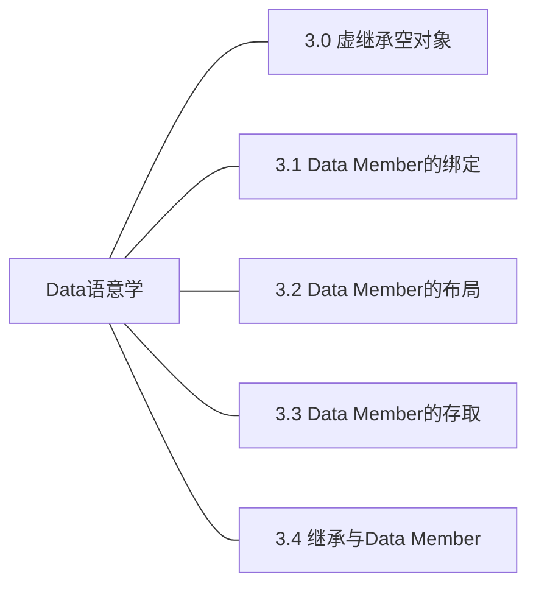

## 第3章 Data语意学

### 3.0 虚继承空对象

### 3.1 Data Member的绑定

### 3.2 Data Member的布局

### 3.3 Data Member的存取
被研究的代码片段：
```c++
Point3d origin;
origin.x = 0.0;
```

需要参考的因素

|表头|静态数据成员|非静态数据成员|
|----|----|----|
|继承|继承的静态数据成员|继承的非静态数据成员|
|非继承|非继承的静态数据成员|非继承的非静态数据成员|

#### 1. 如果x为静态数据成员

1.1 非继承的静态数据成员

实验一：非继承的静态数据成员的存取

实验代码：

```c++
#include<string>
#include<iostream>
using namespace std;
class student{
	private:
		string name;
		int number;
		int exam;
		static int count;  //静态数据是在这里声明而不是定义的
		static int total;
	public:
		student(string s_na,int s_nu,int s_ex) ;
		~student(){};
		void show();
		void print();
};
int student::count=0;  //静态数据在这里定义，如果不定义链接就会报错
int student::total=0; 
student::student(string s_na ,int s_nu , int s_ex ){
	name=s_na;
	number=s_nu;
	exam=s_ex;
	++count;
	total=total+exam;
}
void student::show(){
	cout<<"学生人数："<<count<<"  学生总体成绩："<<total<<endl;
}
void student::print(){
	cout<<"学生名称："<<name<<"  学生学号："<<number<<endl;
	cout<<"***************************"<<endl;
}
int main(){
	student s[3]={student ("张三",1001,10),student ("李四",1002,20),student("王五",1003,30) };
	s[2].show();
	s[3].show();
	return 0;
}

```

实验过程：

```c++
(gdb) tb 27
Temporary breakpoint 1 at 0x1394: file testStaticMember.cpp, line 27.
(gdb) r
Starting program: /mnt/hgfs/VMShare/Inside_the_CPP_Object_Model/a.out 

Temporary breakpoint 1, student::show (this=0x7fffffffe300) at testStaticMember.cpp:27
27		cout<<"学生人数："<<count<<"  学生总体成绩："<<total<<endl;
(gdb) p &count
$1 = (int *) 0x555555558154 <student::count>
(gdb) p &name
$2 = (std::string *) 0x7fffffffe300
(gdb) p &sutdent::count
No symbol "sutdent" in current context.
(gdb) p &(student::count)
$3 = (int *) 0x555555558154 <student::count>
(gdb) disassemble /m
Dump of assembler code for function student::show():
26	void student::show(){
   0x0000555555555384 <+0>:	endbr64 
   0x0000555555555388 <+4>:	push   %rbp
   0x0000555555555389 <+5>:	mov    %rsp,%rbp
   0x000055555555538c <+8>:	sub    $0x10,%rsp
   0x0000555555555390 <+12>:	mov    %rdi,-0x8(%rbp)

27		cout<<"学生人数："<<count<<"  学生总体成绩："<<total<<endl;
=> 0x0000555555555394 <+16>:	lea    0xc6a(%rip),%rsi        # 0x555555556005
   0x000055555555539b <+23>:	lea    0x2c9e(%rip),%rdi        # 0x555555558040 <_ZSt4cout@@GLIBCXX_3.4>
   0x00005555555553a2 <+30>:	callq  0x555555555160 <_ZStlsISt11char_traitsIcEERSt13basic_ostreamIcT_ES5_PKc@plt>
   0x00005555555553a7 <+35>:	mov    %rax,%rdx
   0x00005555555553aa <+38>:	mov    0x2da4(%rip),%eax        # 0x555555558154 <_ZN7student5countE> //这里就是对student::count进行直接存取的地方
   0x00005555555553b0 <+44>:	mov    %eax,%esi
   0x00005555555553b2 <+46>:	mov    %rdx,%rdi
   0x00005555555553b5 <+49>:	callq  0x5555555551d0 <_ZNSolsEi@plt>
   0x00005555555553ba <+54>:	lea    0xc54(%rip),%rsi        # 0x555555556015
   0x00005555555553c1 <+61>:	mov    %rax,%rdi
   0x00005555555553c4 <+64>:	callq  0x555555555160 <_ZStlsISt11char_traitsIcEERSt13basic_ostreamIcT_ES5_PKc@plt>
   0x00005555555553c9 <+69>:	mov    %rax,%rdx
   0x00005555555553cc <+72>:	mov    0x2d86(%rip),%eax        # 0x555555558158 <_ZN7student5totalE>
   0x00005555555553d2 <+78>:	mov    %eax,%esi
   0x00005555555553d4 <+80>:	mov    %rdx,%rdi
   0x00005555555553d7 <+83>:	callq  0x5555555551d0 <_ZNSolsEi@plt>
   0x00005555555553dc <+88>:	mov    %rax,%rdx
   0x00005555555553df <+91>:	mov    0x2bea(%rip),%rax        # 0x555555557fd0
   0x00005555555553e6 <+98>:	mov    %rax,%rsi
   0x00005555555553e9 <+101>:	mov    %rdx,%rdi
   0x00005555555553ec <+104>:	callq  0x555555555170 <_ZNSolsEPFRSoS_E@plt>

28	}
   0x00005555555553f1 <+109>:	nop
   0x00005555555553f2 <+110>:	leaveq 
   0x00005555555553f3 <+111>:	retq   

End of assembler dump.
(gdb) 

```

结论：非继承的静态数据成员是直接进行存取的。

1.2 继承的静态数据成员

与非继承的静态数据成员一样也是直接存取。

实验二：继承的静态数据成员的获取

实验代码：

```c++
#include <iostream>

using namespace std;

class A{
public:
	A()
	{
		cout << "A()" << endl;
	}
	virtual ~A()
	{
		cout << "~A()" << endl;
	}
public:
	static int s_a;
};

class B:public A{
public:
	B()
	{
		cout << "B()" << endl;
	}
	~B()
	{
		cout << "~B()" << endl;
	}
public:
	static int s_b;
};

int A::s_a = 0;
int B::s_b = 0;

int main()
{
	B b;
	A a;
	cout << a.s_a << endl;
	cout << b.s_a << endl;
	cout << b.s_b << endl;
}

```

gdb调试信息如下：

```c++
(gdb) tb 40
Temporary breakpoint 1 at 0x125d: file testStaticMember2.cpp, line 40.
(gdb) r
Starting program: /mnt/hgfs/VMShare/Inside_the_CPP_Object_Model/a.out 
A()
B()
A()

Temporary breakpoint 1, main () at testStaticMember2.cpp:40
40		cout << a.s_a << endl;
(gdb) set disassemble-next-line on
(gdb) disassemble /m
Dump of assembler code for function main():
37	{
   0x0000555555555229 <+0>:	endbr64 
   0x000055555555522d <+4>:	push   %rbp
   0x000055555555522e <+5>:	mov    %rsp,%rbp
   0x0000555555555231 <+8>:	push   %rbx
   0x0000555555555232 <+9>:	sub    $0x28,%rsp
   0x0000555555555236 <+13>:	mov    %fs:0x28,%rax
   0x000055555555523f <+22>:	mov    %rax,-0x18(%rbp)
   0x0000555555555243 <+26>:	xor    %eax,%eax

38		B b;
   0x0000555555555245 <+28>:	lea    -0x28(%rbp),%rax
   0x0000555555555249 <+32>:	mov    %rax,%rdi
   0x000055555555524c <+35>:	callq  0x555555555470 <B::B()>
   0x00005555555552e4 <+187>:	lea    -0x28(%rbp),%rax
   0x00005555555552e8 <+191>:	mov    %rax,%rdi
   0x00005555555552eb <+194>:	callq  0x5555555554ea <B::~B()>
   0x0000555555555322 <+249>:	lea    -0x28(%rbp),%rax
   0x0000555555555326 <+253>:	mov    %rax,%rdi
   0x0000555555555329 <+256>:	callq  0x5555555554ea <B::~B()>
   0x000055555555532e <+261>:	mov    %rbx,%rax
   0x0000555555555331 <+264>:	mov    %rax,%rdi
   0x0000555555555334 <+267>:	callq  0x555555555130 <_Unwind_Resume@plt>

39		A a;
   0x0000555555555251 <+40>:	lea    -0x20(%rbp),%rax
   0x0000555555555255 <+44>:	mov    %rax,%rdi
   0x0000555555555258 <+47>:	callq  0x5555555553ac <A::A()>
   0x00005555555552d8 <+175>:	lea    -0x20(%rbp),%rax
   0x00005555555552dc <+179>:	mov    %rax,%rdi
   0x00005555555552df <+182>:	callq  0x5555555553f6 <A::~A()>
   0x000055555555530d <+228>:	lea    -0x20(%rbp),%rax
   0x0000555555555311 <+232>:	mov    %rax,%rdi
   0x0000555555555314 <+235>:	callq  0x5555555553f6 <A::~A()>
   0x0000555555555319 <+240>:	jmp    0x555555555322 <main()+249>
   0x000055555555531b <+242>:	endbr64 
   0x000055555555531f <+246>:	mov    %rax,%rbx

40		cout << a.s_a << endl;
=> 0x000055555555525d <+52>:	mov    0x2ef1(%rip),%eax        # 0x555555558154 <_ZN1A3s_aE>//父类对自己的静态成员访问
   0x0000555555555263 <+58>:	mov    %eax,%esi
   0x0000555555555265 <+60>:	lea    0x2dd4(%rip),%rdi        # 0x555555558040 <_ZSt4cout@@GLIBCXX_3.4>
   0x000055555555526c <+67>:	callq  0x555555555120 <_ZNSolsEi@plt>
   0x0000555555555271 <+72>:	mov    %rax,%rdx
   0x0000555555555274 <+75>:	mov    0x2d55(%rip),%rax        # 0x555555557fd0
   0x000055555555527b <+82>:	mov    %rax,%rsi
   0x000055555555527e <+85>:	mov    %rdx,%rdi
   0x0000555555555281 <+88>:	callq  0x5555555550f0 <_ZNSolsEPFRSoS_E@plt>

41		cout << b.s_a << endl;
   0x0000555555555286 <+93>:	mov    0x2ec8(%rip),%eax        # 0x555555558154 <_ZN1A3s_aE>//子类对父类的静态成员访问
   0x000055555555528c <+99>:	mov    %eax,%esi
   0x000055555555528e <+101>:	lea    0x2dab(%rip),%rdi        # 0x555555558040 <_ZSt4cout@@GLIBCXX_3.4>
   0x0000555555555295 <+108>:	callq  0x555555555120 <_ZNSolsEi@plt>
--Type <RET> for more, q to quit, c to continue without paging--
   0x000055555555529a <+113>:	mov    %rax,%rdx
   0x000055555555529d <+116>:	mov    0x2d2c(%rip),%rax        # 0x555555557fd0
   0x00005555555552a4 <+123>:	mov    %rax,%rsi
   0x00005555555552a7 <+126>:	mov    %rdx,%rdi
   0x00005555555552aa <+129>:	callq  0x5555555550f0 <_ZNSolsEPFRSoS_E@plt>

42		cout << b.s_b << endl;
   0x00005555555552af <+134>:	mov    0x2ea3(%rip),%eax        # 0x555555558158 <_ZN1B3s_bE>//子类对自己的静态成员访问
   0x00005555555552b5 <+140>:	mov    %eax,%esi
   0x00005555555552b7 <+142>:	lea    0x2d82(%rip),%rdi        # 0x555555558040 <_ZSt4cout@@GLIBCXX_3.4>
   0x00005555555552be <+149>:	callq  0x555555555120 <_ZNSolsEi@plt>
   0x00005555555552c3 <+154>:	mov    %rax,%rdx
   0x00005555555552c6 <+157>:	mov    0x2d03(%rip),%rax        # 0x555555557fd0
   0x00005555555552cd <+164>:	mov    %rax,%rsi
   0x00005555555552d0 <+167>:	mov    %rdx,%rdi
   0x00005555555552d3 <+170>:	callq  0x5555555550f0 <_ZNSolsEPFRSoS_E@plt>

43	}
   0x00005555555552f0 <+199>:	mov    $0x0,%eax
   0x00005555555552f5 <+204>:	mov    -0x18(%rbp),%rcx
   0x00005555555552f9 <+208>:	xor    %fs:0x28,%rcx
   0x0000555555555302 <+217>:	je     0x55555555533e <main()+277>
   0x0000555555555304 <+219>:	jmp    0x555555555339 <main()+272>
   0x0000555555555306 <+221>:	endbr64 
   0x000055555555530a <+225>:	mov    %rax,%rbx
   0x0000555555555339 <+272>:	callq  0x555555555100 <__stack_chk_fail@plt>
   0x000055555555533e <+277>:	add    $0x28,%rsp
   0x0000555555555342 <+281>:	pop    %rbx
   0x0000555555555343 <+282>:	pop    %rbp
   0x0000555555555344 <+283>:	retq   

End of assembler dump.
(gdb) x/1xw 0x2ef1+$rip //父类对自己的静态成员访问
0x55555555814e <_ZSt4cout@@GLIBCXX_3.4+270>:	0x00000000
(gdb) tb *main+93 //断点到距离main偏移93地址的汇编指令处
Temporary breakpoint 2 at 0x555555555286: file testStaticMember2.cpp, line 41.
(gdb) c
Temporary breakpoint 2, main () at testStaticMember2.cpp:41
41		cout << b.s_a << endl;
=> 0x0000555555555286 <main()+93>:	8b 05 c8 2e 00 00	mov    0x2ec8(%rip),%eax        # 0x555555558154 <_ZN1A3s_aE>
(gdb) x/1xw 0x2ec8 + $rip //子类对父类的静态成员访问
0x55555555814e <_ZSt4cout@@GLIBCXX_3.4+270>:	0x00000000
(gdb) b *main + 134 //断点到距离main偏移134地址的汇编指令处
Breakpoint 3 at 0x5555555552af: file testStaticMember2.cpp, line 42.
(gdb) c
Continuing.
0

Breakpoint 3, main () at testStaticMember2.cpp:42
42		cout << b.s_b << endl;
=> 0x00005555555552af <main()+134>:	8b 05 a3 2e 00 00	mov    0x2ea3(%rip),%eax        # 0x555555558158 <_ZN1B3s_bE>
(gdb) x/1xw 0x2ea3 + $rip //子类对自己的静态成员访问
0x555555558152:	0x00000000


```

问题2：空基类内存占用大小

方法：反汇编+gdb调试

实验：

```c++
(gdb) tb 15
Temporary breakpoint 2 at 0x555555555244: file TestClass.cpp, line 15.
(gdb) c
Continuing.

Temporary breakpoint 2, main () at TestClass.cpp:15
15		B b;
(gdb) disassemble /m
Dump of assembler code for function main():
13	{
   0x0000555555555229 <+0>:	endbr64 
   0x000055555555522d <+4>:	push   %rbp
   0x000055555555522e <+5>:	mov    %rsp,%rbp
   0x0000555555555231 <+8>:	sub    $0x40,%rsp
   0x0000555555555235 <+12>:	mov    %fs:0x28,%rax
   0x000055555555523e <+21>:	mov    %rax,-0x8(%rbp)
   0x0000555555555242 <+25>:	xor    %eax,%eax

14		A a, aa;
15		B b;
=> 0x0000555555555244 <+27>:	lea    -0x30(%rbp),%rax
   0x0000555555555248 <+31>:	mov    %rax,%rdi
   0x000055555555524b <+34>:	callq  0x55555555558a <B::B()>

16		C c;
   0x0000555555555250 <+39>:	lea    -0x28(%rbp),%rax
   0x0000555555555254 <+43>:	mov    %rax,%rdi
   0x0000555555555257 <+46>:	callq  0x5555555555ca <C::C()>

17		D d;
   0x000055555555525c <+51>:	lea    -0x20(%rbp),%rax
   0x0000555555555260 <+55>:	mov    %rax,%rdi
   0x0000555555555263 <+58>:	callq  0x5555555555e8 <D::D()>

18		if(&a == &aa) {
19			cout << "a == b" << endl;
20		}
21	
22		cout << "sizeof A: " << sizeof(a) << endl;
   0x0000555555555268 <+63>:	lea    0xd96(%rip),%rsi        # 0x555555556005
   0x000055555555526f <+70>:	lea    0x2dca(%rip),%rdi        # 0x555555558040 <_ZSt4cout@@GLIBCXX_3.4>
   0x0000555555555276 <+77>:	callq  0x555555555100 <_ZStlsISt11char_traitsIcEERSt13basic_ostreamIcT_ES5_PKc@plt>
   0x000055555555527b <+82>:	mov    $0x1,%esi
   0x0000555555555280 <+87>:	mov    %rax,%rdi
   0x0000555555555283 <+90>:	callq  0x5555555550c0 <_ZNSolsEm@plt>
   0x0000555555555288 <+95>:	mov    %rax,%rdx
   0x000055555555528b <+98>:	mov    0x2d3e(%rip),%rax        # 0x555555557fd0
   0x0000555555555292 <+105>:	mov    %rax,%rsi
   0x0000555555555295 <+108>:	mov    %rdx,%rdi
   0x0000555555555298 <+111>:	callq  0x555555555110 <_ZNSolsEPFRSoS_E@plt>

23		cout << "&a: " << hex << &a << " &aa: " << hex << &aa << endl;
   0x000055555555529d <+116>:	lea    0xd6c(%rip),%rsi        # 0x555555556010
   0x00005555555552a4 <+123>:	lea    0x2d95(%rip),%rdi        # 0x555555558040 <_ZSt4cout@@GLIBCXX_3.4>
   0x00005555555552ab <+130>:	callq  0x555555555100 <_ZStlsISt11char_traitsIcEERSt13basic_ostreamIcT_ES5_PKc@plt>
   0x00005555555552b0 <+135>:	lea    0x285(%rip),%rsi        # 0x55555555553c <std::hex(std::ios_base&)>
   0x00005555555552b7 <+142>:	mov    %rax,%rdi
   0x00005555555552ba <+145>:	callq  0x5555555550d0 <_ZNSolsEPFRSt8ios_baseS0_E@plt>
   0x00005555555552bf <+150>:	mov    %rax,%rdx
   0x00005555555552c2 <+153>:	lea    -0x32(%rbp),%rax
   0x00005555555552c6 <+157>:	mov    %rax,%rsi
   0x00005555555552c9 <+160>:	mov    %rdx,%rdi
   0x00005555555552cc <+163>:	callq  0x5555555550e0 <_ZNSolsEPKv@plt>
--Type <RET> for more, q to quit, c to continue without paging--
   0x00005555555552d1 <+168>:	lea    0xd3d(%rip),%rsi        # 0x555555556015
   0x00005555555552d8 <+175>:	mov    %rax,%rdi
   0x00005555555552db <+178>:	callq  0x555555555100 <_ZStlsISt11char_traitsIcEERSt13basic_ostreamIcT_ES5_PKc@plt>
   0x00005555555552e0 <+183>:	lea    0x255(%rip),%rsi        # 0x55555555553c <std::hex(std::ios_base&)>
   0x00005555555552e7 <+190>:	mov    %rax,%rdi
   0x00005555555552ea <+193>:	callq  0x5555555550d0 <_ZNSolsEPFRSt8ios_baseS0_E@plt>
   0x00005555555552ef <+198>:	mov    %rax,%rdx
   0x00005555555552f2 <+201>:	lea    -0x31(%rbp),%rax
   0x00005555555552f6 <+205>:	mov    %rax,%rsi
   0x00005555555552f9 <+208>:	mov    %rdx,%rdi
   0x00005555555552fc <+211>:	callq  0x5555555550e0 <_ZNSolsEPKv@plt>
   0x0000555555555301 <+216>:	mov    %rax,%rdx
   0x0000555555555304 <+219>:	mov    0x2cc5(%rip),%rax        # 0x555555557fd0
   0x000055555555530b <+226>:	mov    %rax,%rsi
   0x000055555555530e <+229>:	mov    %rdx,%rdi
   0x0000555555555311 <+232>:	callq  0x555555555110 <_ZNSolsEPFRSoS_E@plt>

24		cout << "sizeof B: " << sizeof(b) << endl;
   0x0000555555555316 <+237>:	lea    0xcff(%rip),%rsi        # 0x55555555601c
   0x000055555555531d <+244>:	lea    0x2d1c(%rip),%rdi        # 0x555555558040 <_ZSt4cout@@GLIBCXX_3.4>
   0x0000555555555324 <+251>:	callq  0x555555555100 <_ZStlsISt11char_traitsIcEERSt13basic_ostreamIcT_ES5_PKc@plt>
   0x0000555555555329 <+256>:	mov    $0x8,%esi
   0x000055555555532e <+261>:	mov    %rax,%rdi
   0x0000555555555331 <+264>:	callq  0x5555555550c0 <_ZNSolsEm@plt>
   0x0000555555555336 <+269>:	mov    %rax,%rdx
   0x0000555555555339 <+272>:	mov    0x2c90(%rip),%rax        # 0x555555557fd0
   0x0000555555555340 <+279>:	mov    %rax,%rsi
   0x0000555555555343 <+282>:	mov    %rdx,%rdi
   0x0000555555555346 <+285>:	callq  0x555555555110 <_ZNSolsEPFRSoS_E@plt>

25		cout << "sizeof C: " << sizeof(c) << endl;
   0x000055555555534b <+290>:	lea    0xcd5(%rip),%rsi        # 0x555555556027
   0x0000555555555352 <+297>:	lea    0x2ce7(%rip),%rdi        # 0x555555558040 <_ZSt4cout@@GLIBCXX_3.4>
   0x0000555555555359 <+304>:	callq  0x555555555100 <_ZStlsISt11char_traitsIcEERSt13basic_ostreamIcT_ES5_PKc@plt>
   0x000055555555535e <+309>:	mov    $0x8,%esi
   0x0000555555555363 <+314>:	mov    %rax,%rdi
   0x0000555555555366 <+317>:	callq  0x5555555550c0 <_ZNSolsEm@plt>
   0x000055555555536b <+322>:	mov    %rax,%rdx
   0x000055555555536e <+325>:	mov    0x2c5b(%rip),%rax        # 0x555555557fd0
   0x0000555555555375 <+332>:	mov    %rax,%rsi
   0x0000555555555378 <+335>:	mov    %rdx,%rdi
   0x000055555555537b <+338>:	callq  0x555555555110 <_ZNSolsEPFRSoS_E@plt>

26		cout << "sizeof D: " << sizeof(d) << endl;
   0x0000555555555380 <+343>:	lea    0xcab(%rip),%rsi        # 0x555555556032
   0x0000555555555387 <+350>:	lea    0x2cb2(%rip),%rdi        # 0x555555558040 <_ZSt4cout@@GLIBCXX_3.4>
   0x000055555555538e <+357>:	callq  0x555555555100 <_ZStlsISt11char_traitsIcEERSt13basic_ostreamIcT_ES5_PKc@plt>
   0x0000555555555393 <+362>:	mov    $0x10,%esi
   0x0000555555555398 <+367>:	mov    %rax,%rdi
   0x000055555555539b <+370>:	callq  0x5555555550c0 <_ZNSolsEm@plt>
   0x00005555555553a0 <+375>:	mov    %rax,%rdx
   0x00005555555553a3 <+378>:	mov    0x2c26(%rip),%rax        # 0x555555557fd0
   0x00005555555553aa <+385>:	mov    %rax,%rsi
   0x00005555555553ad <+388>:	mov    %rdx,%rdi
   0x00005555555553b0 <+391>:	callq  0x555555555110 <_ZNSolsEPFRSoS_E@plt>
--Type <RET> for more, q to quit, c to continue without paging--

27		return 0;
   0x00005555555553b5 <+396>:	mov    $0x0,%eax

28	}
   0x00005555555553ba <+401>:	mov    -0x8(%rbp),%rcx
   0x00005555555553be <+405>:	xor    %fs:0x28,%rcx
   0x00005555555553c7 <+414>:	je     0x5555555553ce <main()+421>
   0x00005555555553c9 <+416>:	callq  0x555555555120 <__stack_chk_fail@plt>
   0x00005555555553ce <+421>:	leaveq 
   0x00005555555553cf <+422>:	retq   

End of assembler dump.
(gdb)  tb 23
Temporary breakpoint 3 at 0x55555555529d: file TestClass.cpp, line 23.
(gdb) c
Continuing.
sizeof A: 1

Temporary breakpoint 3, main () at TestClass.cpp:23
23		cout << "&a: " << hex << &a << " &aa: " << hex << &aa << endl;
(gdb) i r
rax            0x555555558040      93824992247872
rbx            0x555555555650      93824992237136
rcx            0x7ffff7cf00a7      140737350926503
rdx            0x0                 0
rsi            0x0                 0
rdi            0x7ffff7dd07e0      140737351845856
rbp            0x7fffffffe350      0x7fffffffe350
rsp            0x7fffffffe310      0x7fffffffe310
r8             0x0                 0
r9             0x7fffffffe200      140737488347648
r10            0xfffffffffffff04a  -4022
r11            0x7ffff7c64370      140737350353776
r12            0x555555555140      93824992235840
r13            0x7fffffffe440      140737488348224
r14            0x0                 0
r15            0x0                 0
rip            0x55555555529d      0x55555555529d <main()+116>
eflags         0x213               [ CF AF IF ]
cs             0x33                51
ss             0x2b                43
ds             0x0                 0
es             0x0                 0
fs             0x0                 0
gs             0x0                 0
(gdb) p/x $rbp
$1 = 0x7fffffffe350
(gdb) p/x $rbp - 0x32
$2 = 0x7fffffffe31e
(gdb) p/x $rbp - 0x31
$3 = 0x7fffffffe31f
(gdb) p/x &a
$4 = 0x7fffffffe31e
(gdb) p/x &aa
$5 = 0x7fffffffe31f
(gdb) 
```


#### 2. 如果x为非静态数据成员

实验一：非继承和继承的成员数据的存取过程

```c++
#include <iostream>

using namespace std;

class A {
	public:
		A(int a1, int a2):m_a1(a1), m_a2(a2){}
		virtual void print()
		{
			cout << "A.a1: " << m_a1 << endl;
		}
		virtual void printa2()
		{
			cout << "A.a2: " << m_a2 << endl;
		}
		virtual ~A()
		{
			cout << "~A()" << endl;
		}
	private:
		int m_a1;
	public:
		int m_a2;

};

class B:public A {
	public:
	void printa2()
	{
		cout << "B.m_a2: " << m_a2 << endl;//获取父类的成员编程
	}
	void printb()
	{
		cout << "B.b: " << m_b1 << endl; //获取自己的成员编程
	}
	B(int b1):A(1,2), m_b1(b1){}

	~B(){
		cout << "~B()" << endl;
	}
	private:
	int m_b1;  
};

int main()
{
	B b(66);
	cout << "Get m_a2" << endl;
	b.printa2();
	cout << "Get m_b1" << endl;
	b.printb();
	b.print(); //使用父类方法获取变量
	return 0;
}

```
实验过程：

```c++
(gdb) tb 31  //断点到printa2处
Temporary breakpoint 1 at 0x14e0: file testNoStaticMember1.cpp, line 31.
(gdb) r
Temporary breakpoint 1, B::printa2 (this=0x7fffffffe320) at testNoStaticMember1.cpp:31
31			cout << "B.m_a2: " << m_a2 << endl;
(gdb) disassemble
Dump of assembler code for function B::printa2():
   0x00005555555554d0 <+0>:	endbr64 
   0x00005555555554d4 <+4>:	push   %rbp
   0x00005555555554d5 <+5>:	mov    %rsp,%rbp
   0x00005555555554d8 <+8>:	sub    $0x10,%rsp
   0x00005555555554dc <+12>:	mov    %rdi,-0x8(%rbp)
=> 0x00005555555554e0 <+16>:	lea    0xb31(%rip),%rsi        # 0x555555556018
   0x00005555555554e7 <+23>:	lea    0x2b52(%rip),%rdi        # 0x555555558040 <_ZSt4cout@@GLIBCXX_3.4>
   0x00005555555554ee <+30>:	callq  0x5555555550d0 <_ZStlsISt11char_traitsIcEERSt13basic_ostreamIcT_ES5_PKc@plt>
   0x00005555555554f3 <+35>:	mov    %rax,%rdx
   0x00005555555554f6 <+38>:	mov    -0x8(%rbp),%rax
   0x00005555555554fa <+42>:	mov    0xc(%rax),%eax   //这里就是对m_a2进行取的过程
   0x00005555555554fd <+45>:	mov    %eax,%esi
   0x00005555555554ff <+47>:	mov    %rdx,%rdi
   0x0000555555555502 <+50>:	callq  0x555555555120 <_ZNSolsEi@plt>
   0x0000555555555507 <+55>:	mov    %rax,%rdx
   0x000055555555550a <+58>:	mov    0x2abf(%rip),%rax        # 0x555555557fd0
   0x0000555555555511 <+65>:	mov    %rax,%rsi
   0x0000555555555514 <+68>:	mov    %rdx,%rdi
   0x0000555555555517 <+71>:	callq  0x5555555550f0 <_ZNSolsEPFRSoS_E@plt>
   0x000055555555551c <+76>:	nop
   0x000055555555551d <+77>:	leaveq 
   0x000055555555551e <+78>:	retq
(gdb) ni //在gdb上设置set disassemble-next-line on后可以使用ni进行汇编语言级别调试
0x00005555555554fa	31			cout << "B.m_a2: " << m_a2 << endl;
   0x00005555555554f6 <B::printa2()+38>:	48 8b 45 f8	mov    -0x8(%rbp),%rax
=> 0x00005555555554fa <B::printa2()+42>:	8b 40 0c	mov    0xc(%rax),%eax
   0x00005555555554fd <B::printa2()+45>:	89 c6	mov    %eax,%esi
   0x00005555555554ff <B::printa2()+47>:	48 89 d7	mov    %rdx,%rdi
   0x0000555555555502 <B::printa2()+50>:	e8 19 fc ff ff	callq  0x555555555120 <_ZNSolsEi@plt>
   0x0000555555555507 <B::printa2()+55>:	48 89 c2	mov    %rax,%rdx
(gdb) p/x $rax//查看rax寄存器
$4 = 0x7fffffffe320
(gdb) x/1xw 0x7fffffffe320+0xc //获取m_a2的值
0x7fffffffe32c:	0x00000002
(gdb) tb 35 //断点到printb处
Temporary breakpoint 2 at 0x555555555530: file testNoStaticMember1.cpp, line 35.
(gdb) c
Temporary breakpoint 2, B::printb (this=0x7fffffffe320) at testNoStaticMember1.cpp:35
35			cout << "B.b: " << m_b1 << endl;
(gdb) ni
0x000055555555554a	35			cout << "B.b: " << m_b1 << endl;
   0x0000555555555546 <B::printb()+38>:	48 8b 45 f8	mov    -0x8(%rbp),%rax
=> 0x000055555555554a <B::printb()+42>:	8b 40 10	mov    0x10(%rax),%eax
   0x000055555555554d <B::printb()+45>:	89 c6	mov    %eax,%esi
   0x000055555555554f <B::printb()+47>:	48 89 d7	mov    %rdx,%rdi
   0x0000555555555552 <B::printb()+50>:	e8 c9 fb ff ff	callq  0x555555555120 <_ZNSolsEi@plt>
   0x0000555555555557 <B::printb()+55>:	48 89 c2	mov    %rax,%rdx
(gdb) x/1xw 0x10+$rax //获取m_b1的值
0x7fffffffe330:	0x00000042
```

实验结论：
**非继承和继承的成员数据的存取过程一样，成员数据在编译时期就已经确定位置了，可直接存取。**

### 3.1 Data Member的绑定

### 3.2 Data Member的布局