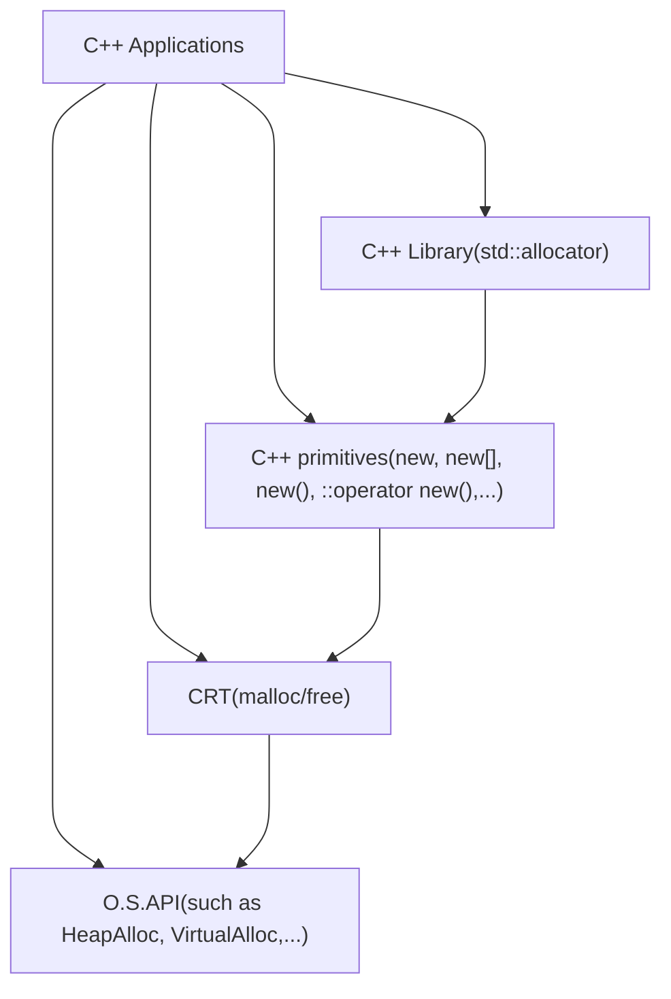
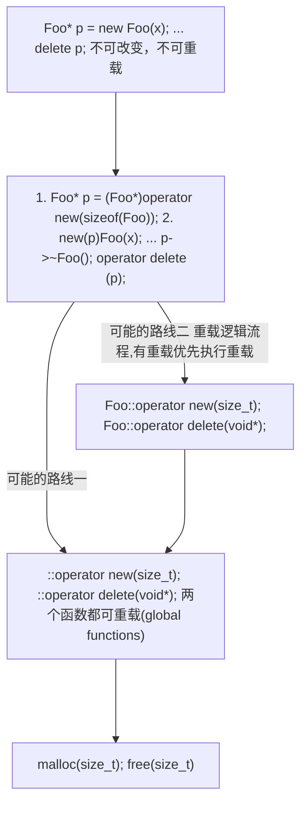

## 带有指针的类
```c++
#include <iostream>
#include <string>
#include <cstring>


using namespace std;

//NOTE: os << str, operator<<不可以时成员函数，如果是成员函数的话会出现方向相反的情况。
//即str << os;必须是全局的函数
static ostream& operator<<(ostream& os, const String& str)
{
	os << str.get_c_str();
	return os;
}


class String
{
public:
	String(const char* cstr = 0);
	String(const String& str);//NOTE: 拷贝构造，特点：传参是它自己的类型参数
	//NOTE:要在operator=中检查是否存在自我赋值的情况
	String& operator=(const String& str); //NOTE: 拷贝赋值,特点：传参是它自己的类型参数
	~String();
	char* const get_c_str()
	{
		return m_data;
	}
private:
	char* m_data;
};

inline String::String(const char *cstr = 0) {
	if(cstr) {
		m_data = new char[strlen(cstr) + 1];
		strncpy(m_data, cstr, strlen(cstr));
	} else {
		m_data = new char[1];
		m_data[0] = '\0';
	}
}

inline String::String() {
	delete [] m_data;
}

inline String::String(const String& str) {
	if(m_data == str.m_data) {
		return ;
	}
	m_data = new char[strlen(str.m_data) + 1];
	strncpy(m_data, str.m_data, strlen(str.m_data));
}

inline String& String::operator=(const String& str) {
	if(this == &str) {
		return *this;
	}
	delete []m_data;
	m_data = new char[strlen(str.m_data) + 1];
	strncpy(m_data, str.m_data, strlen(str.m_data));
	return *this;
}
int main()
{
	String s1("hello "); 
	cout << s1;
	return 0;
}

```

new:先分配memory，再调用ctor
```c++
Complex* pc = new Complex(1,2);
编译器转为：
Complex* pc;
1. void* mem = operator new(sizeof(Complex)); new内部使用malloc申请空间
2. pc = static_cast<Complex*>(mem);
3. pc->Complex::Complex(1,2); # Complex::Complex(pc, 1,2)
```

delete:先调用dtor,再释放memory

```c++
String::~String(ps);
operator delete(ps); #内部free(ps);
```

类存在指针成员时，必须要考虑拷贝构造和拷贝赋值函数

array new一定要和array delete一起使用。
```c++
String* p = new String[3];
...//TODO: do something
delete [] p;//NOTE: 这样写编译器才识别到p指向的是数组，所以会调用三次析构函数
delete p;//NOTE: 这样写编译器无法识别p指向的是数组，所以只会调用一次析构函数，而在String中存在m_data指针，所以除数组第一个元素会被调用到析构函数外，其他的元素都不会被调用到析构函数，故造成内存泄漏。如果String中没有m_data则不会存在内存泄漏。
```

虚函数继承

1. 非虚函数：不希望子类重写该方法；
2. 虚函数：希望子类重写定义该方法，但是已有默认的一定；
3. 纯虚函数：希望子类一定要定义该方法； 


|分配|释放|类属|是否可重载|
|--|--|--|--|
|malloc|free()|C函数|不可|
|new|delete|C++表达式|不可|
|::operator new()|::operator delete()|C++函数|可|
|allocator<T>::allocate()|allocator<T>::deallocatr()|C++标准库|可允许设计并以之搭配任何容器|


```c++
class Shape {
public:
    virtual void draw() const = 0;//纯虚函数
    virtual void error(const std::string& msg);//虚函数
    int objectID() const; //非虚函数
};
```

### 直接调用分配器方法

```c++
void* p1 = malloc(512);
free(p1);

complex<int>* p2 = new complex<int>;
delete p2;

void* p3 = ::operator new(512);
::operator delete(p3);

#ifdef _MSC_VER
	int* p4 = allocator<int>().allocate(3, (int*)0);
	allocator<int>().deallocate(p4, 3);
#endif

#ifdef __BORLANDC__
	int* p4 = allocator<int>().allocate(5);
	allocator<int>().deallocate(p4, 5);
#endif

#ifdef __GNUC__ 
//NOTE: 这个写法已不再使用
	void* p4 = alloc::allocate(512);
	alloc::deallocate(p4, 512);
//NOTE: 下面的写法为通用写法
	void* p4 = allocator<int>().allocate(7);
	allocator<int>.deallocate((int*)p4, 7);
//NOTE: 以下两个函数都是non-static,需要通过object调用，一下分配9个int
void* p5 = __gnu_cxx::__pool_alloc<int>().allocate(9);
__gnu_cxx::__pool_alloc<int>().deallocate((int*)p5, 9);
#endif
```

### new expression
```c++
Complex* pc = new Complex(1,2);
//NOTE: new expression会被编译其转为下面的三步
try {
	void* mem = operator new(sizeof(Complex)); // operator new是函数，可重载
	pc = static_cast<Complex*>(mem);
	pc->Complex::Complex(1,2);
} catch (std::bad_alloc) {
	//TODO: allocation失败就不执行申请内存的步骤
}

//NOTE:  const std::nothrow_t&表示该函数不抛出异常
void *operator new(size_t size, const std::nothrow_t&) {
	void *p;
	while((p = malloc(size)) == 0) {
		_TRY_BEGIN
		if(_callnewh(size) == 0) break;
		//NOTE: _callnewh 函数是用户定制实现的，用于释放size的空间，然后再去malloc申请内存的时候好申请成功。
		_CATCH(std::bad_alloc) return (0);
		_CATCH_END
	}
	return (p);
}
```

### delete expression

```c++
Complex* pc = new Complex(1,2);
delete pc;
//NOTE: delete pc相当于执行下面的两句
pc->~Complex();
operator delete(pc);//NOTE: operator delete的定义如下：

void __cdecl operator delete(void* p)_THROW0()
{
	//some code
	free(p);
}
```

### array new, array delete

```c++
A* buf = new A[size];
A* tmp = buf;
//NOTE: placement new的用法
for(int i = 0; i < size; ++i) {
	new(tmp++)A(i); //new(tmp)A(i)：在tmp地址处创建A对象，并用i初始化.
}
delete []buf;
```
### placement new

```c++
#include <new>

char* buf = new char[sizeof(Complex)*3];
//placement new允许将Object建在已经分配好内存的地址上。所以placement new不会申请内存，而是创建对象，其对应的相反的操作是placement delete。
Complex* pc = new(buf)Complex(1,2);
delete []buf;
//NOTE: new(buf)Complex(1,2);对应下面的代码
Complex* pc;
try{
	void* mem = operator new(sizeof(Complex), buf);
	pc = static_cast<Complex*>(mem);
	pc->Complex::Complex(1,2);
}
//operator new(sizeof(Complex), buf)的实现伪代码如下：
void* operator new(size_t, void* loc) {
	return loc;
}
```



### 重载operator new/operator delete

```c++
Foo* p = new Foo;
...
delete p;

try {
	void* mem = operator new(sizeof(Foo));
	p = static_cast<Foo*>(mem);
	p->Foo::Foo();
}

class Foo {
public:
	void* operator new(size_t);
	void operator dlete(void*, size_t);
};
```

```c++
Foo* p = new Foo[N];
...
delete[] p;
//NOTE: new[]只会申请空间不会调用构造函数,然后使用placement new创建对象, new[]()会调用构造函数。
try {
	pObj = static_cast<Foo*>(p);
	for(int i = 0; i < N; ++i) {
		new(pObj++)Foo();
	}
}

class Foo {
public:
	void* operator new[](size_t);
	void operator dlete[](void*, size_t);
};
```

### 重载::operator new/::operator delete

//NOTE: 这个全局operator new 和operator delete影响是全局的。
```c++
void myAlloc(size_t size)
{
	return malloc(size);
}

void myFree(void* ptr)
{
	return free(ptr);
}

inline void* operator new(size_t size)
{
	return myAlloc(size);
}

inline void* operator new[](size_t size)
{
	return myAlloc(size);
}

inline void operator delete(size_t size)
{
	return myFree(size);
}

inline void operator delete[](size_t size)
{
	return myFree(size);
}
```
### 10. 重载operator new/operator delete示例

```c++
见operatorNew.cpp文件
```

### 11. 重载 new()/delete()示例

!!DEBUG: new()和operator new的重载怎么区分呢？？？ !!

我们可以重载class member operator new(),写出多个版本，前提是声明的入参必须独一无二，其中第一个参数必须是size_t,其余参数以new所指定的placement arguments为初值。出现与new(...)小括号内的便是所谓placement arguments.示例如下：
```c++
Foo* pf = new(300, 'c')Foo;
//第一个参数必须是size_t
```
我们也可以重载class member operator delete(),写出多个版本。但是它们绝不会被delete调用。只有当new所调用的ctor抛出expection,才会调用这些重载版本的operator delete().它只可能这样被调用。主要用来归还未能完全创建成功的object所占用的memory。placement delete要与placement new配套（没有对应的placement delete也可以编译通过，但是编译会有警告），即入参形式一致（不是一样，placement delete的第一个入参是void*,替换掉placenew的第一个参数即可）。
示例如下：
```c++
class Foo {
public:
    int _id;
    long _data;
    string _str;

public:
    Foo():_id(0) {
        cout << "default ctor.this = " << hex << this << " id = " << _id << endl;
    }

    Foo(int id):_id(id)  {
        cout << "ctor.this = " << hex << this << " id = " << _id << endl;
		throw Bad();//NOTE: 这里抛出错误就会调用placement new对应的placement delete。
    }

    ~Foo() {
        cout << "dtor.this = " << hex << this << " id = " << _id << endl;
    }

public:
    void* operator new(size_t size) {
        return malloc(size);
    }

    void* operator new(size_t size, void* start) {
        return start;
    }

    void* operator new(size_t size, long extra) {
        return malloc(size + extra); 
    }

    void* operator new(size_t size, long extra, char init) {
        return malloc(size + extra);
    }

    void operator delete(void* p) {
    }

    void operator delete(void* p, void* start) {
    }

    void operator delete(void* p, long extra) {
    }

    void operator delete(void *p, long extra, char init) {
    }
};

```
basic_string的实现就有重载operator new()

TODO: 12 没有这个视频

### 重载版本二：per-class allocator, 2

```c++

class Airplane {
private:
	struct AirplaneRep {
		unsigned long miles;
		char type;
	};

	union {
		AirplaneRep rep;
		Airplane* next;
	};

public:
	unsigned long getMiles() {
		return rep.miles;
	}

	char getType() {
		return rep.type;
	}

	void set(unsigned long m, char t) {
		rep.miles = m;
		rep.type = t;
	}

public:
	static void* operator new(size_t size);
	static void operator delete(void* deadObject, size_t size);

private:
	static const int BLOCK_SIZE;
	static Airplane* headOfFreeList;

};

Airplane* Airplane::headOfFreeList;
const int Airplane::BLOCK_SIZE = 512;

void* operator new(size_t size) {
	if(size != sizeof(Airplane)) {
		return ::operator new(size);
	}
	Airplane* p = headOfFreeList;
	if(p) {
		headOfFreeList = p->next;
	} else {
		Airplane* newBlock = static_cast<Airplane*>(::operator new(BLOCK_SIZE*sizeof(Airplane)));
		//i初始值跳过0的原因时第零个空间要返回去作为本地的执行结果
		for(int i = 1; i < BLOCK_SIZE - 1; ++i) {
			newBlock[i].next = &newBlock[i+1];
		}
		newBlock[BLOCK_SIZE-1].next = 0;
		p = newBlock;
		headOfFreeList = &newBlock[1];
	}
	return p;
}

void Airplane::operator delete(void* deadObject, size_t size) {
	if(0 == deadObject) {
		return ;
	}
	if(size != sizeof(Airplane)) {
		::operator delete(deadObject);
		return ;
	}
	Airplane* carcass = static_cast<Airplane*>(deadObject);
	carcass->next = headOfFreeList;
	headOfFreeList = carcass;//优化点：这里并没有将内存释放给系统，而是保留在了自己手上了。
}
```

### 重载版本三：static allocator

当你受困与必须为不同的classes重写几乎相同的member operator new和member operator delete时，应该有方法将一个总是分配特定尺寸的区块的memory allocator概念包装起来，使它容易被重复使用。一下展示一种作法，每个allocator object都是个分配器，它体内维护一个free-list;不同的allocator objects维护不同的free-list。
```c++
class allocator {
private:
	struct obj{
		struct obj* next;
	};

public:
	void* allocate(size_t);
	void deallocate(void*, size_t);

private:
	obj* freeStore = nullptr;
	const int CHUNK = 5;
};

void* allocator::allocate(size_t size) {
	obj* p;
	if(!freeStore) {
		size_t chunk = CHUNK*size;
		freeStore = p = (obj*)malloc(chunk);
		for(int i = 0; i < (CHUNK-1); ++i) {
			p->next = (obj*)((char*)p + size);
			p = p->next;
		}
		p->next = nullptr;
	}
	p = freeStore;
	freeStore = freeStore->next;
	return p;
}

void allocator::deallocate(void* p, size_t) {
	((obj*)p)->next = freeStore;
	freeStore = (obj*)p;
}

//使用allocator的示例
class Foo {
public:
	long L;
	string str;
	static allocator myAlloc;

public:
	Foo(long l):L(l) {}
	
	static void* operator new(size_t size) {
		return myAlloc.allocator(size);
	}

	static void operator delete(void* pdead, size_t size) {
		return myAlloc.deallocator(pdead, size);
	}
};
!!DEBUG: 声明和定义怎么区分呢？？？ !!
allocator Foo::myAlloc;


class Goo {
public:
	complex<double> c;
	string str;
	static allocator myAlloc;
public:
	Goo(const complex<double>& x):c(x){}

	static void* operator new(size_t size) {
		return myAlloc.allocator(size);
	}

	static operator delete(void* pdead, size_t size) {
		return myAlloc.deallocate(pdead, size);
	}
};

allocator Goo::myAlloc;
```
使用allocator去管理内存要比之前的干净多了，application class不在对内存分配细节纠缠不清，所有的内存相关细节都让allocator去操心，我们的工作时让application class正确运作。

### 重载版本四：macro for static allocator

使用宏重写上面的Foo类

```c++
#define DECLARE_POOL_ALLOC() \
public:\
void* operator new(size_t size) {return myAlloc.allocate(size);}
void operator delete(void* pdead, size_t size) {return myAlloc.deallocate(pdead, size);}

#define IMPLEMENT_POOL_ALLOC(class_name)\
allocator class_name::myAlloc;

class Foo {
	DECLARE_POOL_ALLOC()
public:
	long L;
	string str;
public:
	Foo(long l):L(l){}
};
IMPLEMENT_POOL_ALLOC(Foo)
```

### 重载版本五：global allocator——标准库的allocator

### new handle

当operator new没有能力为你分配出你所申请的memory,会抛出一个std::bad_alloc exception。某些老版版一起则是返回0。通过使用new(nothrow) Foo来避免抛出异常。
在抛出exception之前会先（不止一次）调用一个可由用户指定的handler，以下是new handler的形式和设定方法：
```c++
typedef void (*new_handler)();
new_handler set_new_handler(new_handler p) throw(); NOTE:在C++标准库提供的。这个函数需要学习一下，如果先set_new_handler(funcA)然后再set_new_handler(funcB)的时候就会返还funcA。

void *operator new(size_t size, const std::nothrow_t&) {
	void *p;
	while((p = malloc(size)) == 0) {
		_TRY_BEGIN
		if(_callnewh(size) == 0) break;
		//NOTE: 当报出异常后就会在_callnewh 函数里面调用set_new_handler设置的new_handler函数，用于释放size的空间，然后再去malloc申请内存的时候好申请成功。
		_CATCH(std::bad_alloc) return (0);
		_CATCH_END
	}
	return (p);
}
```
设计良好的new handler只有两个选择：
1. 让更多的内存可用；
2. 调用abort()或exit()；

使用示例：
```c++
#include <new>
#include <iostream>
#include <cassert>

using namespace std;

void noMoreMemory()
{
	cout << "out of memory";
	abort();
}

void main()
{
	set_new_handler(noMoreMemory);

	int* p = new int[100000000000000000];
	assert(p);
	int* p = new int[10000000000000000000];
	assert(p);	
}
```
### =default,=delete

```c++
class Goo {
public:
	complex<double> c;
	string str;
	static allocator myAlloc;
public:
	Goo(const complex<double>& x):c(x){}

	static void* operator new(size_t size)=default; //DEBUG: 编译报错[Error]cannot be defaulted;

	static operator delete(void* pdead, size_t size)=default; //DEBUG: 编译报错

	static void* operator new[](size_t size)=delete; //DEBUG: 编译通过

	static operator delete[](void* pdead, size_t size)=delete; //DEBUG: 编译通过
};

Goo* pG = new Goo[10]; //DEBUG: 编译报错;
delete[] pG;  //DEBUG: 编译报错
```
TODO: 17
