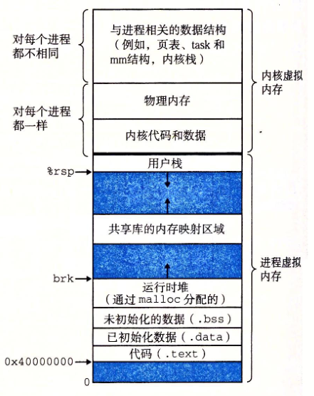

问题1：如何确定某个地址是在栈区还是在堆区？

方法：断点到要定位地址的地方，然后bt，查看栈顶寄存器的值（栈空间的最小值，记为minVal），然后退到栈底最后一帧，查看当前栈的栈底（栈空间的最大值，记为maxVal）。设要查看的地址为x。则：

    1. 如果x∈[minVal, maxVal]，那么该地址在栈区； 
    2. 如果x <  minVal,那么该地址可能在堆区；
    3. 如果 x > maxVal，那么该地址非法；
   
理论依据：

如图所示



对当前进程而言，断点位置对应的栈范围上界是由栈顶的%rsp决定，下界是由栈底的%rbp决定的。且栈的低地址区有“栈预留区域”、“共享库的内存映射区域”、“堆预留区域”、“未初始化数据段”、“已初始化数据段”、“代码段”、“内核”。 如果确定我们要查看的变量不属于“共享库的内存映射区域”、“未初始化数据段”、“已初始化数据段”、“代码段”则可以根据上诉方法定位该变量是在栈上还是在堆上。

实验验证：

测试代码（使用live555项目，客户端发起拉流的流程查看, 对应代码为RTSPServer.cpp，查看变量fURLPreSuffix和fStreamStates）:
```c++
(gdb) f 0
#0  RTSPServer::RTSPClientSession::handleCmd_PLAY (this=0x555555632870, ourClientConnection=0x5555556287d0, subsession=0x0, 
    fullRequestStr=0x555555628868 "PLAY rtsp://IP:8554/test.264/ RTSP/1.0\r\nCSeq: 5\r\nUser-Agent: LibVLC/3.0.17.4 (LIVE555 Streaming Media v2016.11.28)\r\nSession: 86FAFE5A\r\nRange: npt=0.000-\r\n\r\n") at RTSPServer.cpp:1725
1725			 ServerMediaSubsession* subsession, char const* fullRequestStr) {
(gdb) bt   //1. 查看调用栈信息
#0  RTSPServer::RTSPClientSession::handleCmd_PLAY (this=0x555555632870, ourClientConnection=0x5555556287d0, subsession=0x0, 
    fullRequestStr=0x555555628868 "PLAY rtsp://IP:8554/test.264/ RTSP/1.0\r\nCSeq: 5\r\nUser-Agent: LibVLC/3.0.17.4 (LIVE555 Streaming Media v2016.11.28)\r\nSession: 86FAFE5A\r\nRange: npt=0.000-\r\n\r\n") at RTSPServer.cpp:1725
#1  0x000055555557e08d in RTSPServer::RTSPClientSession::handleCmd_withinSession (this=0x555555632870, 
    ourClientConnection=0x5555556287d0, cmdName=<optimized out>, urlPreSuffix=<optimized out>, urlSuffix=0x7fffffffdb20 "", 
    fullRequestStr=0x555555628868 "PLAY rtsp://IP:8554/test.264/ RTSP/1.0\r\nCSeq: 5\r\nUser-Agent: LibVLC/3.0.17.4 (LIVE555 Streaming Media v2016.11.28)\r\nSession: 86FAFE5A\r\nRange: npt=0.000-\r\n\r\n") at RTSPServer.cpp:1685
#2  0x000055555557ba53 in RTSPServer::RTSPClientConnection::handleRequestBytes (this=0x5555556287d0, newBytesRead=169)
    at RTSPServer.cpp:867
#3  0x0000555555579185 in GenericMediaServer::ClientConnection::incomingRequestHandler (this=0x5555556287d0)
    at GenericMediaServer.cpp:359
#4  0x00005555555d28af in BasicTaskScheduler::SingleStep (this=0x555555626eb0, maxDelayTime=<optimized out>)
    at BasicTaskScheduler.cpp:180
#5  0x00005555555d3c23 in BasicTaskScheduler0::doEventLoop (this=0x555555626eb0, watchVariable=0x0) at BasicTaskScheduler0.cpp:83
#6  0x0000555555577028 in main (argc=<optimized out>, argv=<optimized out>) at ../UsageEnvironment/include/UsageEnvironment.hh:59
(gdb) p/x fURLPreSuffix //2. 查看栈区变量的地址
$10 = 0x7fffffffda50
(gdb) p/x fStreamStates //3. 查看堆区变量的地址 fStreamStates = new struct streamState[fNumStreamStates];
$11 = 0x5555556327d0
(gdb) i r     //4. 查看当前栈顶的地址
rax            0x555555603360      93824992949088
rbx            0x55555564bdc0      93824993246656
rcx            0x555555628868      93824993101928
rdx            0x0                 0
rsi            0x5555556287d0      93824993101776
rdi            0x555555632870      93824993142896
rbp            0x7fffffffdb20      0x7fffffffdb20
rsp 进程栈顶->  0x7fffffffd8c8      0x7fffffffd8c8
r8             0x7fffffffdb20      140737488345888
r9             0x555555628868      93824993101928
r10            0xd52a0             873120
r11            0x7fffffffda50      140737488345680
r12            0x0                 0
r13            0x555555632870      93824993142896
r14            0x5555556287d0      93824993101776
r15            0x7fffffffda50      140737488345680
rip            0x55555557c840      0x55555557c840 <RTSPServer::RTSPClientSession::handleCmd_PLAY(RTSPServer::RTSPClientConnection*, ServerMediaSubsession*, char const*)>
eflags         0x246               [ PF ZF IF ]
cs             0x33                51
ss             0x2b                43
ds             0x0                 0
es             0x0                 0
fs             0x0                 0
gs             0x0                 0
(gdb) f 6   //5. 回退到最初的栈
#6  0x0000555555577028 in main (argc=<optimized out>, argv=<optimized out>) at ../UsageEnvironment/include/UsageEnvironment.hh:59
59	  TaskScheduler& taskScheduler() const {return fScheduler;}
(gdb) i r //6. 查看栈底地址
rax            0x555555603360      93824992949088
rbx            0x5555555d1ca0      93824992746656
rcx            0x555555628868      93824993101928
rdx            0x0                 0
rsi            0x5555556287d0      93824993101776
rdi            0x555555632870      93824993142896
rbp 进程栈底->  0x555555627340      0x555555627340
rsp            0x7fffffffe310      0x7fffffffe310
r8             0x7fffffffdb20      140737488345888
r9             0x555555628868      93824993101928
r10            0xd52a0             873120
r11            0x7fffffffda50      140737488345680
r12            0x555555627780      93824993097600
r13            0x555555627340      93824993096512
r14            0x555555627b30      93824993098544
r15            0x0                 0
rip            0x555555577028      0x555555577028 <main(int, char**)+680>
eflags         0x246               [ PF ZF IF ]
cs             0x33                51
ss             0x2b                43
ds             0x0                 0
es             0x0                 0
fs             0x0                 0
gs             0x0                 0
(gdb) 


```
结论：查看地址fURLPreSuffixf和StreamStates两个变量的地址范围和变量在代码处的定义一致，支持了上述所述的结论。